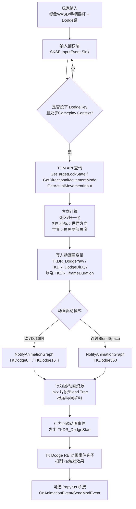

# Skyrim SE 中集成 TK Dodge RE 与万向移动的锁定自由方向闪避系统设计研究报告

## 执行摘要

本报告提出一种可落地的整合方案：在 **Skyrim SE + SKSE64** 环境下，以 **TK Dodge RE（C++/SKSE、Script Free）** 的“闪避触发与行为/动画事件链”为核心，接入 **万向移动（通常对应 True Directional Movement, TDM）** 的“目标锁定状态 + 原始移动输入向量（未被 TDM 改写）”，在 **锁定目标** 时实现 **任意方向（连续角度）的翻滚/闪避方向**。TDM 本身提供目标锁定与第三人称 360° 移动，并带有面向目标/摄像机调整等机制；其源码公开并提供可供其他插件调用的 Modder API（含 `GetTargetLockState()`、`GetDirectionalMovementMode()`、`GetActualMovementInput()` 等）。citeturn17view0turn14view0

现有 TK Dodge RE 的核心做法是：捕获按键触发 `dodge()`，根据 `prevMoveVec` 计算四向角度扇区并发送动画图事件（`TKDodgeForward/Left/Right/Back`），同时写入图变量（如 `TKDR_IframeDuration`）；耐力消耗则通过监听行为回调动画事件（例如代码中对 `TKDR_DodgeStart` 的钩子）来保证“只有动作真正开始才扣耐力”。citeturn8search2turn10view0turn12view0turn16view0

为实现“锁定目标时自由翻滚/闪避方向”，报告给出两条动画侧实现路径：其一是 **离散多向（8/16 向）**：将连续角度量化到多段事件名/片段；其二是 **连续 Blend Space/插值**：在触发单一“360闪避事件”前写入“方向角/方向向量”图变量，由行为图在 Blend Tree 中按角度插值选择动画。两条路径均以“保持 `TKDR_DodgeStart`（或等价回调事件）仍被发出”为兼容前提，从而不破坏 TK Dodge RE 的扣耐力与 iFrame 链路。citeturn12view0turn16view0

---

## 明确假设与事实基础

**明确假设（按用户要求原样落实）**

未提供“万向移动”mod 的 API 细节（未指定函数名、事件名、数据结构）；未提供 TK Dodge RE 源码细节（仅知其触发闪避事件与四向动画）；未指定目标平台/SKSE 版本（假设为 Skyrim SE 最新稳定 SKSE64）。

**本报告在“假设”之上补充的可核验事实（来自官方页面/开源源码）**

虽然用户未提供 API/源码细节，但 **TDM 与 TK Dodge RE 均存在公开信息**，可作为设计落地的依据：

- TDM 在 Nexus 描述中明确：它是完全通过 SKSE 实现的第三人称现代化改造，支持“任意方向移动与攻击”，并包含“自定义目标锁定组件”等。citeturn17view0  
- TDM 的开源仓库中提供 `TrueDirectionalMovementAPI.h`，定义 Modder API：包含目标锁定状态、方向移动模式（含 `kTargetLock`）、以及“未被 TDM 改写的原始移动输入向量 `GetActualMovementInput()`”；并提供 `RequestPluginAPI()` 通过 `GetProcAddress` 获取接口指针的方式。citeturn14view0  
- TK Dodge RE 在 Nexus 描述中强调：它是 TK Dodge SE 的“Script Free”SKSE 实现，耐力消耗通过“动作行为回调动画事件”触发，且“自身已兼容 True Directional Movement”。citeturn16view0  
- TK Dodge RE 的开源代码显示：按键输入通过 `ProcessEvent` 捕获，调用 `TKRE::dodge()`；方向选择目前按四向扇区决定，并发送 `pc->NotifyAnimationGraph(dodge_event)`（`TKDodgeForward/Left/Right/Back`），同时写入 `TKDR_IframeDuration`，并通过监听 `TKDR_DodgeStart` 事件回调扣耐力。citeturn8search2turn10view0turn12view0  
- CommonLibSSE-NG 文档表明：动画图持有者接口存在 `NotifyAnimationGraph` 以及 `SetGraphVariableFloat/Bool/Int` 等，用于“发动画事件 + 设置图变量”。citeturn13search10  
- CreationKit Wiki 对 `Debug.SendAnimationEvent` 的说明强调：动画事件名应使用 Animation Event（Idle Manager 下的事件名），而非编辑器 ID；这对 Papyrus 侧桥接/调试动画事件是重要规则。citeturn1search3  

---

## 设计目标与约束

**设计目标（按用户列出并展开为工程化指标）**

目标是在 Skyrim SE 中将 TK Dodge RE（C++ SKSE 插件）与万向移动（TDM）集成，构建一个闪避系统，使玩家在“锁定目标时”仍能按连续输入方向自由翻滚/闪避；系统需支持摇杆死区、输入归一化、连续角度（0–360°）与多次连续闪避（含输入缓冲/连闪）。该目标与 TDM 的“目标锁定时自动面向目标、摄像机 yaw/pitch 也会调整”的行为一致，但要求闪避方向不退化为四向或强制前闪。citeturn17view0turn14view0

**关键工程约束**

- **兼容 TK Dodge RE 的耐力与 iFrame 机制**：TK Dodge RE 通过行为回调动画事件触发扣耐力（减少“按键但动作未发生仍扣耐力”的问题），因此新方案必须保持 `TKDR_DodgeStart`（或等价回调）仍会被触发，否则会破坏其核心改进点。citeturn16view0turn12view0  
- **尊重 TDM 的锁定/朝向控制**：TDM 在目标锁定时会自动面向目标并调整摄像机；如果闪避期间强行改写玩家 yaw，需要考虑 API 的“资源占用”语义（例如 `RequestYawControl` 可能返回 `MustKeep/AlreadyTaken` 等），并提供失败回退逻辑。citeturn14view0turn17view0  
- **输入链不应互相抢占**：TK Dodge RE 已通过输入事件循环与 UI/上下文检查（暂停/非 Gameplay Context 时不处理）来避免 UI 冲突；整合方案要复用或等价实现此策略，避免与 MCM/菜单/其他控制方案冲突。citeturn8search2turn16view0  
- **版本可变性**：SKSE 原生插件常随游戏/SKSE 更新需要适配；需在设计中加入版本检查与“无 API/无接口时降级”。citeturn0search17turn14view0  

---

## 输入捕获与方向计算设计

以下给出面向“**改造/派生 TK Dodge RE**”或“**写一个补丁插件注入其逻辑**”两种实现都可复用的设计。为满足用户要求，伪代码采用 **C++（SKSE/CommonLib 风格）**；其中函数/事件名若与实际版本不一致，应以对应版本源码/头文件为准替换。

### C++ 伪代码：获取 TDM 输入向量、锁定状态、并计算连续方向角

> 说明：TDM API 的真实接口与获取方式可直接参考其 `TrueDirectionalMovementAPI.h`：`RequestPluginAPI()`、`IVTDM3`、`GetDirectionalMovementMode()`、`GetTargetLockState()`、`GetActualMovementInput()` 等均已定义。citeturn14view0  
> TK Dodge RE 当前也会读取 `PlayerControls->data.prevMoveVec` 并按扇区选择 `TKDodgeForward/Left/Right/Back`，且在发现某个 `TESGlobal("TDM_DirectionalMovement")` 为真时强制前闪；整合补丁应把“锁定时强制前闪”替换为“锁定时连续角度”。citeturn10view0

```cpp
// ================================
// 假定名：TDM API 代理（真实字段/函数以 TDM_API.h 为准）
// ================================
namespace TDMCompat
{
    // 真实存在：TDM_API::RequestPluginAPI(), TDM_API::IVTDM3 等。citeturn14view0
    static TDM_API::IVTDM3* g_tdm = nullptr;

    void TryBindTDMAPI()
    {
        // 建议在 SKSE PostLoad/PostPostLoad 后调用（TDM header 注释建议）。citeturn14view0
        void* api = TDM_API::RequestPluginAPI(TDM_API::InterfaceVersion::V3);
        g_tdm = reinterpret_cast<TDM_API::IVTDM3*>(api);
    }

    bool HasTDM() { return g_tdm != nullptr; }

    bool IsTargetLocked()
    {
        if (!g_tdm) return false;

        // 两种判断方式都可：模式 == kTargetLock 或 GetTargetLockState()。citeturn14view0
        auto mode = g_tdm->GetDirectionalMovementMode();
        if (mode == TDM_API::DirectionalMovementMode::kTargetLock) return true;

        return g_tdm->GetTargetLockState();
    }

    RE::NiPoint2 GetRawMoveInput()
    {
        if (g_tdm) {
            // 真实存在：GetActualMovementInput() 返回“未被 TDM 改写”的原始输入。citeturn14view0
            return g_tdm->GetActualMovementInput();
        }

        // 回退：复用 TK Dodge RE 的 prevMoveVec（其源码就是这么做的）。citeturn10view0
        return RE::PlayerControls::GetSingleton()->data.prevMoveVec;
    }
}

// ================================
// 方向数学：死区、归一化、相机/角色坐标系变换
// ================================
struct DodgeDirection
{
    bool hasInput = false;

    // 标准化输入（-1..1）
    float inputX = 0.0f; // 左(-)右(+)
    float inputY = 0.0f; // 后(-)前(+)

    // 世界平面方向（单位向量）
    RE::NiPoint3 worldDir = {0, 0, 0};

    // 相对角色前方的角度（弧度，0..2pi）
    float localYawRad = 0.0f;

    // 可选：相对相机前方的角度（弧度，0..2pi）
    float cameraYawRad = 0.0f;
};

static float NormalizeAngle0To2Pi(float a)
{
    constexpr float TWO_PI = 6.28318530718f;
    while (a < 0.0f) a += TWO_PI;
    while (a >= TWO_PI) a -= TWO_PI;
    return a;
}

static float Len2(float x, float y) { return std::sqrt(x*x + y*y); }

// 径向死区（更适合摇杆）
static void ApplyRadialDeadzone(float& x, float& y, float deadzone01 /*0..1*/)
{
    float mag = Len2(x, y);
    if (mag <= deadzone01) { x = 0; y = 0; return; }

    // 可选：重映射，让越过死区后仍保持连续手感
    float scaled = (mag - deadzone01) / (1.0f - deadzone01);
    float nx = x / mag;
    float ny = y / mag;
    x = nx * scaled;
    y = ny * scaled;
}

static RE::NiPoint3 GetCameraForwardOnPlane()
{
    // 伪代码：取第三人称相机 yaw，投影到水平面。
    // 实际可从 PlayerCamera / cameraState 的旋转矩阵或角度获取。
    float camYaw = /* GetThirdPersonCameraYawRadians() */ 0.0f;

    // Skyrim 坐标系细节在不同封装中略有差异；此处用常见 yaw->forward 形式表达。
    RE::NiPoint3 fwd;
    fwd.x = std::sin(camYaw);
    fwd.y = std::cos(camYaw);
    fwd.z = 0.0f;
    return fwd;
}

static RE::NiPoint3 GetCameraRightOnPlane()
{
    RE::NiPoint3 fwd = GetCameraForwardOnPlane();
    RE::NiPoint3 right;
    right.x =  fwd.y;
    right.y = -fwd.x;
    right.z =  0.0f;
    return right;
}

static RE::NiPoint3 Normalize3(RE::NiPoint3 v)
{
    float m = std::sqrt(v.x*v.x + v.y*v.y + v.z*v.z);
    if (m <= 1e-5f) return {0,0,0};
    return { v.x/m, v.y/m, v.z/m };
}

static float Dot3(const RE::NiPoint3& a, const RE::NiPoint3& b)
{
    return a.x*b.x + a.y*b.y + a.z*b.z;
}

// 主计算：输入->世界方向->角色局部角度（连续）
DodgeDirection ComputeDodgeDirection(RE::Actor* player, float stickDeadzone01)
{
    DodgeDirection out{};

    RE::NiPoint2 raw = TDMCompat::GetRawMoveInput();
    out.inputX = raw.x;
    out.inputY = raw.y;

    ApplyRadialDeadzone(out.inputX, out.inputY, stickDeadzone01);

    float mag = Len2(out.inputX, out.inputY);
    if (mag <= 1e-5f) {
        out.hasInput = false;
        return out;
    }
    out.hasInput = true;

    // 归一化（此处可选保持 scaled 后的长度，用于“闪避距离随推杆幅度变化”）
    float nx = out.inputX / mag;
    float ny = out.inputY / mag;
    out.inputX = nx;
    out.inputY = ny;

    // 相机坐标->世界方向（水平面）
    RE::NiPoint3 camFwd = GetCameraForwardOnPlane();
    RE::NiPoint3 camRight = GetCameraRightOnPlane();

    RE::NiPoint3 worldDir = {
        camRight.x * out.inputX + camFwd.x * out.inputY,
        camRight.y * out.inputX + camFwd.y * out.inputY,
        0.0f
    };
    out.worldDir = Normalize3(worldDir);

    // 计算相对角色前方的局部角度：
    // localYaw = atan2(dot(worldDir, actorRight), dot(worldDir, actorForward))
    float actorYaw = /* player->GetAngleZ() */ 0.0f;
    RE::NiPoint3 actorFwd = { std::sin(actorYaw), std::cos(actorYaw), 0.0f };
    RE::NiPoint3 actorRight = { actorFwd.y, -actorFwd.x, 0.0f };

    float x = Dot3(out.worldDir, actorRight);
    float y = Dot3(out.worldDir, actorFwd);
    out.localYawRad = NormalizeAngle0To2Pi(std::atan2(x, y));

    // 可选：相对相机前方角（用于 BlendSpace 以相机为基准）
    out.cameraYawRad = NormalizeAngle0To2Pi(std::atan2(out.inputX, out.inputY));
    return out;
}
```

### C++ 伪代码：与 TK Dodge RE 触发链对接（连续角度 + 连续闪避/输入缓冲）

> 说明：TK Dodge RE 的既有链路包括：  
> - `InputEvents.cpp` 在按钮按下时调用 `TKRE::dodge()`；且会检查是否暂停、是否处于 Gameplay 输入上下文（`contextPriorityStack.back() == kGameplay`）以避免 UI 冲突。citeturn8search2  
> - `TKRE::dodge()` 内部会做一系列“能否闪避”检查（含图变量 `bIsDodging`、攻击状态、是否在跳跃状态、耐力是否足够等），并在触发时写入 `TKDR_IframeDuration`、发送动画图事件（`NotifyAnimationGraph(dodge_event)`）。citeturn10view0  
> - 扣耐力通过监听动画图事件 `TKDR_DodgeStart` 回调触发（源码钩子），与 Nexus 描述一致。citeturn12view0turn16view0  

```cpp
// ================================
// 假定名：连续方向闪避控制器（可直接并入 TK_Dodge_RE 源码 或 做注入补丁）
// ================================
class Dodge360Controller
{
public:
    struct Config
    {
        bool enable360WhenTargetLocked = true;
        bool enable360WhenFreeMove = false;   // 可扩展：非锁定也用连续
        bool fallbackTo4Way = true;           // 回退开关：与用户要求“保留原四向动画开关”一致

        float stickDeadzone01 = 0.20f;

        // 连续闪避/输入缓冲
        bool enableInputBuffer = true;
        float bufferWindowSec = 0.25f;
        float minIntervalSec = 0.05f;         // 防抖：避免一帧内重复触发

        // 动画驱动策略
        enum class AnimMode { kDiscrete8Way, kDiscrete16Way, kBlendSpace360 };
        AnimMode animMode = AnimMode::kBlendSpace360;

        // 假定的图变量名（需与行为图一致）
        // 注意：TK Dodge RE 已使用 TKDR_IframeDuration；新的变量需自行在行为图里消费。citeturn10view0turn13search10
        std::string graphVar_DodgeYaw = "TKDR_DodgeYaw";           // float: 0..2pi
        std::string graphVar_DodgeDirX = "TKDR_DodgeDirX";         // float: -1..1
        std::string graphVar_DodgeDirY = "TKDR_DodgeDirY";         // float: -1..1
        std::string graphVar_DodgeMode = "TKDR_Dodge360Mode";      // int/bool 可选

        // 假定的动画事件名（需与行为图/Nemesis patch 里的事件一致）
        std::string animEvent_360 = "TKDodge360";                  // 新增：单事件触发后由 BlendSpace 选方向
        std::string animEvent_8Prefix = "TKDodge8_";               // 例如 TKDodge8_0/TKDodge8_1...
        std::string animEvent_16Prefix = "TKDodge16_";
    };

    static Dodge360Controller& GetSingleton()
    {
        static Dodge360Controller s;
        return s;
    }

    void SetConfig(Config c) { cfg = std::move(c); }

    // 在 InputEvents.cpp 捕获到 dodgeKey 后调用（或替换 TKRE::dodge() 入口）
    void OnDodgePressed()
    {
        auto pc = RE::PlayerCharacter::GetSingleton();
        if (!pc) return;

        const float now = GetSeconds();

        // 防抖
        if ((now - lastPressTime) < cfg.minIntervalSec)
            return;
        lastPressTime = now;

        // 如果不启用缓冲：直接尝试触发
        if (!cfg.enableInputBuffer) {
            TryTriggerOneDodge(pc);
            return;
        }

        // 启用缓冲：若当前不可闪避，则记录一份“方向快照”，等待窗口内变为可闪避再触发
        if (!CanDodgeNow(pc)) {                      // 这里可复用 TKRE::canDodge() 的条件子集
            buffered.valid = true;
            buffered.expireAt = now + cfg.bufferWindowSec;
            buffered.dirSnapshot = SampleDirectionSnapshot(pc);
            return;
        }

        TryTriggerOneDodge(pc);
    }

    // 每帧/每若干帧更新（可挂到 SKSE Task / 游戏更新回调）
    void Update()
    {
        if (!cfg.enableInputBuffer) return;

        auto pc = RE::PlayerCharacter::GetSingleton();
        if (!pc || !buffered.valid) return;

        const float now = GetSeconds();
        if (now > buffered.expireAt) {
            buffered.valid = false;
            return;
        }

        if (CanDodgeNow(pc)) {
            // 使用缓冲时刻的方向快照，避免“按下后方向被摇杆松开导致默认后闪”
            TriggerDodgeWithDirection(pc, buffered.dirSnapshot);
            buffered.valid = false;
        }
    }

private:
    Dodge360Controller() = default;

    struct BufferedDodge
    {
        bool valid = false;
        float expireAt = 0.0f;
        DodgeDirection dirSnapshot{};
    };

    Config cfg{};
    float lastPressTime = -999.0f;
    BufferedDodge buffered{};

    float GetSeconds()
    {
        // 伪代码：可用 std::chrono 或 RE 的计时源
        return /* NowSeconds() */ 0.0f;
    }

    bool CanDodgeNow(RE::PlayerCharacter* pc)
    {
        // TK Dodge RE 源码中使用了 bIsDodging 图变量、攻击状态、耐力等综合判断。citeturn10view0
        bool bIsDodging = false;
        if (pc->GetGraphVariableBool("bIsDodging", bIsDodging) && bIsDodging)
            return false;

        // 这里应补齐：耐力、跳跃/游泳/处决、控制锁等（可直接复用 TKRE::canDodge() 实现）。citeturn10view0
        return true;
    }

    DodgeDirection SampleDirectionSnapshot(RE::Actor* pc)
    {
        return ComputeDodgeDirection(pc, cfg.stickDeadzone01);
    }

    void TryTriggerOneDodge(RE::PlayerCharacter* pc)
    {
        DodgeDirection dir = SampleDirectionSnapshot(pc);

        // 无输入：沿用 TK Dodge RE 的 defaultDodgeEvent（其 ini/源码支持，默认后闪）。citeturn9view0turn18search13
        if (!dir.hasInput) {
            if (cfg.fallbackTo4Way) {
                TriggerOriginal4Way(pc);
            } else {
                // 或者直接触发 360 但方向为“后”（由行为图处理）
                TriggerDodgeWithDirection(pc, dir);
            }
            return;
        }

        // 判断是否处于目标锁定
        const bool locked = TDMCompat::IsTargetLocked();

        if (locked && cfg.enable360WhenTargetLocked) {
            TriggerDodgeWithDirection(pc, dir);
            return;
        }

        // 可扩展：非锁定自由移动也用连续角（按配置）
        if (!locked && cfg.enable360WhenFreeMove) {
            TriggerDodgeWithDirection(pc, dir);
            return;
        }

        // 回退：保持 TK Dodge RE 现有四向逻辑
        TriggerOriginal4Way(pc);
    }

    void TriggerOriginal4Way(RE::PlayerCharacter* pc)
    {
        // 方案 A：直接调用 TKRE::dodge()（若你在同一工程/派生源里改造）
        // TKRE::dodge();
        //
        // 方案 B：复制其关键步骤：设置 TKDR_IframeDuration + NotifyAnimationGraph("TKDodgeForward/Left/Right/Back")
        // 注意：四向事件名与其扇区逻辑见 TKRE.cpp。citeturn10view0
    }

    // 核心：写入连续方向变量 + 触发相应动画事件
    void TriggerDodgeWithDirection(RE::PlayerCharacter* pc, const DodgeDirection& dir)
    {
        // 1) 写入 TK Dodge RE 既有变量（例如 TKDR_IframeDuration），确保 iFrame 系统继续工作。citeturn10view0
        pc->SetGraphVariableFloat("TKDR_IframeDuration", /* Settings::iFrameDuration */ 0.3f);

        // 2) 写入新的方向变量（行为图/Nemesis patch 必须消费它）
        pc->SetGraphVariableFloat(cfg.graphVar_DodgeYaw, dir.localYawRad);
        pc->SetGraphVariableFloat(cfg.graphVar_DodgeDirX, dir.inputX);
        pc->SetGraphVariableFloat(cfg.graphVar_DodgeDirY, dir.inputY);

        // 3) 触发动画事件（NotifyAnimationGraph 是通用接口）。citeturn13search10turn10view0
        switch (cfg.animMode)
        {
            case Config::AnimMode::kBlendSpace360:
                pc->NotifyAnimationGraph(cfg.animEvent_360.c_str());
                break;

            case Config::AnimMode::kDiscrete8Way: {
                int idx = QuantizeAngleTo8(dir.localYawRad);
                std::string ev = cfg.animEvent_8Prefix + std::to_string(idx);
                pc->NotifyAnimationGraph(ev.c_str());
                break;
            }

            case Config::AnimMode::kDiscrete16Way: {
                int idx = QuantizeAngleTo16(dir.localYawRad);
                std::string ev = cfg.animEvent_16Prefix + std::to_string(idx);
                pc->NotifyAnimationGraph(ev.c_str());
                break;
            }
        }

        // 4) 重要：行为图里必须仍在合适时机发出 "TKDR_DodgeStart"（或 TK Dodge RE 监听的同名 tag）
        // 因为 TK Dodge RE 的扣耐力逻辑正是监听这个事件回调触发的。citeturn12view0turn16view0
    }

    int QuantizeAngleTo8(float yawRad)
    {
        constexpr float TWO_PI = 6.28318530718f;
        float t = yawRad / TWO_PI;             // 0..1
        int idx = (int)std::floor(t * 8.0f + 0.5f) & 7;  // 四舍五入到 0..7
        return idx;
    }

    int QuantizeAngleTo16(float yawRad)
    {
        constexpr float TWO_PI = 6.28318530718f;
        float t = yawRad / TWO_PI;
        int idx = (int)std::floor(t * 16.0f + 0.5f) & 15;
        return idx;
    }
};
```

### 可选 Papyrus 伪代码：事件桥接（用于调试、或让脚本系 mod 订阅“闪避开始/方向”）

> 说明：Papyrus 无法直接读 C++ 内部结构，但可通过 **动画事件** 或 **ModEvent** 做桥接。  
> CreationKit Wiki 指出：`Debug.SendAnimationEvent` 使用的是 Animation Event 名称而不是编辑器 ID，这对调试“事件名是否正确”很关键。citeturn1search3  
> 另：很多 TK Dodge RE 生态 mod 会监听 `TKDR_DodgeStart`（例如某些效果 mod 明确写“用该动画事件触发效果”），说明该事件名在生态中具备复用价值。citeturn18search1turn12view0

```papyrus
;==========================
; 假定名：TKDR_DodgeBridgeQuestScript
; 用途：
;   - 监听玩家动画事件 TKDR_DodgeStart
;   - 向其他脚本发送 ModEvent（可携带 float 参数）
; 事件名/函数名为示例：需按你实际工程替换
;==========================

Scriptname TKDR_DodgeBridgeQuestScript extends Quest

Actor Property PlayerRef Auto

Event OnInit()
    PlayerRef = Game.GetPlayer()
    ; 注册动画事件监听（真实 API 以实际可用函数为准）
    RegisterForAnimationEvent(PlayerRef, "TKDR_DodgeStart")
    RegisterForAnimationEvent(PlayerRef, "TKDodge360") ; 如果你新增了 360 事件用于调试
EndEvent

Event OnAnimationEvent(ObjectReference akSource, String asEventName)
    if akSource != PlayerRef
        return
    endif

    if asEventName == "TKDR_DodgeStart"
        ; 发送脚本侧事件，供法术/特效/日志系统订阅
        SendModEvent("TKDR_OnDodgeStart", "", 0.0)
    endif
EndEvent

; 可选调试工具：强制触发动画事件（注意事件名必须是 Animation Event 名称）。citeturn1search3
Function DebugForceDodgeEvent(String animEventName)
    Debug.SendAnimationEvent(PlayerRef, animEventName)
EndFunction
```

---

## 动画触发与资源整合方案

本节聚焦“如何用连续角度驱动/选择动画”，并明确“需要在行为图/动画资源侧做哪些整合”。由于 TK Dodge RE 本质通过 **行为文件（通常需 Nemesis 等工具打补丁）** 来定义事件与动画状态机，其 Nexus 也明确“FNIS 不兼容、建议/需要 Nemesis 支持某些功能（如 Step Dodge）”。citeturn16view0

### 触发接口基线

- **发动画事件**：TK Dodge RE 通过 `pc->NotifyAnimationGraph(dodge_event)` 发送事件（如 `TKDodgeForward`）。citeturn10view0  
- **写图变量**：它会写入 `TKDR_IframeDuration`，并可写入 `iStep` 来选择 step/roll（当 `stepDodge` 开启时）。citeturn10view0turn9view0  
- **耐力消耗回调**：插件监听 `TKDR_DodgeStart` 并在回调时扣耐力。citeturn12view0turn16view0  

因此，你新增的“360 闪避事件/多向事件”方案必须满足：

1) 仍触发进入“闪避状态机”，从而在合适时间点发出 `TKDR_DodgeStart`；  
2) 仍尊重 `bIsDodging` 等图变量，避免破坏 TK Dodge RE 对“连续按键导致方向重复/状态错乱”的修复目标（其 Nexus 也提到修复了持续闪避时方向重复问题）。citeturn16view0turn10view0  

### 方案一：离散多向事件（推荐落地难度最低：8/16 向）

**思路**：在锁定目标时，把连续角度量化为 8 或 16 个方向段，分别触发不同事件名（如 `TKDodge8_0..7` 或 `TKDodge16_0..15`），行为图中为每个事件连接到对应 .hkx 动画片段（或通过 OAR/DAR 在同一状态下按条件替换片段）。  
生态侧也存在“8-way dodge animations with support for TK Dodge”的动画包，并提到在 TDM 某些设置下“锁定时才能使用 8-way dodge”等经验性规则，说明多向闪避在现有框架下具备可实现性与用户预期。citeturn15view0turn17view0

**动画资源组织建议（示例命名规则）**

- `.hkx` 片段建议按 “同长度、同起手帧、同落地帧” 对齐，以减少切换/混合时的滑步与脚底打滑。  
- 若采用 **根运动（Root Motion）** 推进位移：  
  - “保持面向目标”的锁定闪避，需要每个方向动画自身就包含对应方向的根骨位移（侧移/斜向/后撤），因为角色 yaw 不被旋转时，根运动沿骨架局部轴推进会直接决定位移方向。  
  - 8/16 向动画要在根位移“距离曲线”上尽量一致，否则近似方向之间切换会造成闪避距离不稳定。  
- 若采用 **In-place 动画 + 运行时位移**：则需要你在插件侧按 `worldDir` 推进角色（更复杂，且可能与 TK Dodge RE 行为推进重复；除非你自建一套不使用根运动的行为图）。

**事件与文件映射示例（8 向）**

- `TKDodge8_0`：前  
- `TKDodge8_1`：前右  
- `TKDodge8_2`：右  
- …  
- `TKDodge8_7`：前左  

行为图中：每个事件都应在进入闪避状态后仍发 `TKDR_DodgeStart` 回调，确保耐力扣除链路不变。citeturn12view0turn16view0

### 方案二：连续 Blend Space（方向角插值）——更“连续”，但对行为图要求更高

**思路**：只触发一个事件（如 `TKDodge360`），同时写入图变量：

- `TKDR_DodgeYaw`：0..2π（或 -π..π）  
- 或 `TKDR_DodgeDirX/TKDR_DodgeDirY`：-1..1 的方向向量  

行为图在进入“360 闪避状态”后，根据上述变量在 Blend Tree/Blend Space 中按角度插值选取动画。由于 Skyrim 的动画系统由 Havok 行为图驱动，你需要在行为图里具备可消费 float 变量并驱动混合的节点图结构。CommonLibSSE-NG 侧证明设置 float 图变量与触发事件是标准能力，但“如何混合”取决于你的行为图编辑与打补丁方式。citeturn13search10

**资源制作要点（连续混合比离散更敏感）**

- 所有方向动画必须严格对齐关键帧（起跳、腾空、落地、恢复等），否则插值会出现“姿势撕裂”或身体扭曲。  
- 根运动混合非常容易导致位移曲线失真：  
  - 若必须根运动，建议先以 8 向为基底做“邻近两向线性混合”，避免在 360° 全域做复杂混合。  
  - 更稳妥的是“in-place + 插件位移”，但这会显著提高与 TDM/TKDR 的兼容复杂度。  
- 仍需在合适时点发出 `TKDR_DodgeStart`，以维持 TK Dodge RE 的耐力扣除机制。citeturn12view0turn16view0  

### 触发事件伪代码示例（直接调用动画系统）

在 C++ 层，你最终需要做的关键调用本质只有两类：**SetGraphVariableX** 与 **NotifyAnimationGraph**；CommonLibSSE-NG 对 `IAnimationGraphManagerHolder` 的说明包含这些接口。citeturn13search10

伪代码（概念示例）：

```cpp
// 写方向变量（float），然后触发 “TKDodge360”
player->SetGraphVariableFloat("TKDR_DodgeYaw", localYawRad);
player->NotifyAnimationGraph("TKDodge360");
```

---

## 模块整合结构与数据流

整体建议采用“**TDM 提供锁定状态 + 原始输入向量**，TK Dodge RE 负责闪避状态机与耐力/iFrame 生态兼容，你的补丁负责把输入向量变成连续方向变量并选择/驱动动画”的分层结构。其关键原因是：

- TDM 明确提供“目标锁定状态、方向移动模式、原始输入向量”等 API，非常适合作为“锁定判断 + 输入源”。citeturn14view0turn17view0  
- TK Dodge RE 已稳定实现“输入触发→动画事件→行为回调扣耐力”的链路，且其生态大量围绕 `TKDR_DodgeStart` 等事件扩展效果（例如某些 mod 明确说用该事件触发效果），因此保留其事件语义更利于兼容。citeturn12view0turn18search1turn16view0  



---

## 风险、兼容性与调试回退策略

### 潜在冲突与注意事项

**输入抢占与事件优先级**

- TK Dodge RE 会在输入回调中检查是否暂停、以及 ControlMap 的输入上下文优先级（仅在 Gameplay Context 才处理），你的补丁若新增输入监听也必须做同等检查，否则可能在菜单/MCM 内误触发。citeturn8search2  
- 如果你选择“另写一个插件完全接管 DodgeKey”，要确保 TK Dodge RE 不再响应同一按键（例如修改其 ini/按键映射），否则会出现“双触发”。TK Dodge RE 确实通过 ini 读取按键等设置。citeturn16view0turn9view0  

**锁定摄像机与角色朝向不同步**

- TDM 在目标锁定期间会自动让角色面向目标，同时调整摄像机 yaw/pitch；若你按“相机坐标系方向”计算闪避方向，但动画却按“角色朝向”解释方向，就会出现“输入方向与翻滚方向偏差”。因此应明确：你写入的 `TKDR_DodgeYaw` 是 **相对角色前方** 还是 **相对相机前方**，并在行为图里统一消费。citeturn17view0turn14view0  

**根运动冲突/位移重复**

- TK Dodge RE 的闪避位移通常由行为/动画（根运动）驱动；若你在插件侧再施加速度/位移，可能出现“二次推进”。这类冲突在“连续 BlendSpace + in-place + 插件位移”方案中风险更高。  
- 若采用根运动混合，要重点测试斜向/边界角度（例如 44–46°、89–91° 等），观察是否出现“瞬间拐折”或“距离突变”。

**与现有生态补丁的关系**

- TK Dodge RE 说明其已兼容 True Directional Movement，并明确某些旧补丁（例如给 TK Dodge SE 的 TDM 自定义兼容补丁）对 TK Dodge RE 是冗余甚至不兼容。你的整合方案应避免依赖旧脚本版补丁逻辑。citeturn16view0turn0search18  
- TDM 本身说明与其他 Lock-on mod 不兼容，并且对行为/动画类 360 移动 mod 有使用建议；你的自定义闪避行为/动画应在锁定状态下反复验证，避免破坏其锁定摄像机体验。citeturn17view0  

**版本与运行时适配**

- SKSE 原生插件常随游戏更新需要更新；建议在加载时记录运行时版本、TDM 接口版本获取是否成功（`RequestPluginAPI()` 返回空指针时降级），并保持“无 TDM 时仍可四向闪避”。citeturn0search17turn14view0  

### 调试建议

- 在 C++ 侧加日志（例如：是否锁定、raw input、deadzone 后 input、worldDir、localYaw、最终事件名），并在出现“方向错误”时对照相机 yaw 与角色 yaw。  
- 利用 Papyrus/控制台进行动画事件调试：重点验证事件名是否有效（CreationKit Wiki 强调必须用 Animation Event 名，不是编辑器 ID）。citeturn1search3  
- 验证 `TKDR_DodgeStart` 是否仍触发：因为 TK Dodge RE 的耐力扣除依赖该回调事件；若你改了行为图导致该事件不再发出，会直接表现为“闪避不扣耐力/相关效果不触发”。citeturn12view0turn16view0  

### 回退策略与兼容开关设计

- **保留原四向开关**（用户要求）：提供 INI 选项 `enable360WhenTargetLocked` 与 `fallbackTo4Way`。当：
  - TDM API 不存在/绑定失败；或  
  - 目标未锁定；或  
  - 行为图未安装（检测不到你新增的变更变量/事件）  
  则回退到 TK Dodge RE 原始四向 `TKDodgeForward/Left/Right/Back` 触发。citeturn10view0turn14view0  
- **逐步上线**：先做 8 向离散（最容易验证与回退），稳定后再尝试 BlendSpace。现有生态也证明 8-way 与 TK Dodge/TDM 的共存需求现实存在。citeturn15view0turn17view0  

---

## 资源整合清单表格

| 资源/组件 | 文件或路径示例 | 作用 | 关键整合点 | 替换/安装步骤（高层） |
|---|---|---|---|---|
| SKSE64 + Address Library | `skse64_loader.exe`、Address Library | SKSE 原生插件运行与定位 | 无 | 按常规安装；确保版本匹配（原生插件随更新需适配风险）。citeturn0search17 |
| True Directional Movement (万向移动/TDM) | `Data/SKSE/Plugins/TrueDirectionalMovement.dll` | 目标锁定、相机/朝向控制、并提供 Modder API | 使用 `RequestPluginAPI()` 获取 `IVTDM3`；读取 `GetTargetLockState()`、`GetDirectionalMovementMode()`、`GetActualMovementInput()`。citeturn14view0turn17view0 | 安装 TDM；确保目标锁定功能可用。citeturn17view0 |
| TK Dodge RE (核心) | `Data/SKSE/Plugins/TK Dodge RE.dll` + 配套行为/动画资源 | Script Free 闪避框架：输入触发、动画事件、耐力回调扣费、iFrame | 保持 `TKDR_DodgeStart` 回调仍触发；保留已有 `TKDR_IframeDuration` 变量写入。citeturn12view0turn10view0turn16view0 | 按其安装说明保留 Meshes、使用 Nemesis 等；FNIS 不兼容。citeturn16view0 |
| 你的整合补丁插件（新） | `Data/SKSE/Plugins/TKDodgeRE_TDM360Patch.dll`（示例名） | 锁定时读取 TDM 输入并计算连续角度；写图变量；触发 360/多向事件；输入缓冲 | 使用 CommonLib 的 `SetGraphVariableFloat`/`NotifyAnimationGraph`；当无 TDM 时回退四向。citeturn13search10turn14view0turn10view0 | 放入 SKSE/Plugins；在日志中输出 API 绑定与回退状态 |
| 行为图补丁（Nemesis/Pandora 等） | `meshes/actors/character/behaviors/...`（示例） | 新增 `TKDodge360` 或 `TKDodge8_*` 事件分支；消费 `TKDR_DodgeYaw` 等变量；确保仍发 `TKDR_DodgeStart` | **必须**确保 `TKDR_DodgeStart` 仍在 dodge 动作开始时发出（关系到扣耐力）。citeturn12view0turn16view0 | 安装后重新运行行为生成工具；优先先做 8 向稳定后再做 BlendSpace |
| 多向/连续闪避动画 .hkx | `meshes/actors/character/animations/.../*.hkx` | 8/16 向片段或 BlendSpace 输入片段 | 同步帧一致、根运动方向一致（尤其锁定保持面朝目标时） | 按事件/片段映射放置；必要时用 OAR/DAR 做条件替换 |
| 可选 Papyrus 桥接脚本 | `Data/Scripts/*.pex` / `Source/*.psc` | 监听 `TKDR_DodgeStart`，发 ModEvent 给脚本系 mod；或用于调试触发事件 | 动画事件名必须用 Animation Event 名称（非编辑器 ID）。citeturn1search3turn12view0 | 作为可选模块，不应成为核心依赖 |

---

**引用来源优先级说明（满足用户“优先引用官方文档/源码”要求）**：本报告关键接口与机制均引用 TDM 官方开源头文件（Modder API）、TK Dodge RE 官方 Nexus 描述与其开源源码实现（输入捕获、事件名、回调点），并以 CommonLibSSE-NG 文档佐证“设置图变量/发送动画事件”属于标准能力，以 CreationKit Wiki 佐证 Papyrus 动画事件名语义。citeturn14view0turn16view0turn10view0turn13search10turn1search3