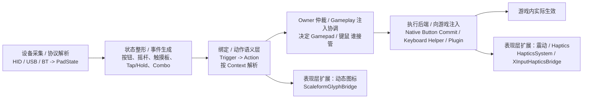

# DualPad Quick Handoff

## Current Focus

当前主线仍然是**动态图标**，但仓库已经回退到更早的基线，必须按现在的代码状态理解：

- 当前仓库里真正存在并可直接继续开发的动态图标主线，是：
  - `src/input/glyph/ScaleformGlyphBridge.*`
  - `config/DualPadBindings.ini`
  - 主菜单 `Interface/startmenu.swf`
- 之前那套 `FavoritesMenu` 专项 SWF patch 工作区、分析文档包、执行桥增强和页面级 broker 代码，当前**不在仓库里**
- 因此，新窗口不要默认认为：
  - `FavoritesMenu.as`
  - `MappedButton.as`
  - `ButtonPanel.as`
  - `tools/swf_patch/work/.../import_scripts_minimal/...`
  这些路径现在仍可用

一句话：**当前仓库是“通用动态图标桥 + 主菜单已落地 + FavoritesMenu 仍是旧验证态”的版本。**

## Environment Basics

- Repo root: `C:/Users/xuany/Documents/dualPad`
- C++ plugin build:
  - `xmake build DualPad`
- 当前 repo 内的 SWF 产物：
  - `Interface/startmenu.swf`
- 当前 repo **没有**：
  - `Interface/favoritesmenu.swf`
  - `tools/swf_patch/work/norden_favoritesmenu_dsesvg3_patch1/...`
- 当前外部 live `favoritesmenu.swf` 仍存在于：
  - `G:/skyrim_mod_develop/mods/dualPad/Interface/favoritesmenu.swf`
- 当前外部 live `favoritesmenu.swf` SHA256：
  - `335C9CC7FD6AE6B3E560C3FC4530C494159E07B889EA7BF06B5FECE1669602F1`
- 主日志：
  - `C:/Users/xuany/Documents/My Games/Skyrim Special Edition/SKSE/DualPad.log`

## Read First

当前回退版接手时，优先看这些：

1. `src/input/glyph/ScaleformGlyphBridge.cpp`
2. `src/input/glyph/ScaleformGlyphBridge.h`
3. `config/DualPadBindings.ini`
4. `src/input/Action.h`
5. `src/input/BindingManager.cpp`
6. `docs/main_menu_glyph_current_status_zh.md`
7. `docs/dynamic_glyph_svg_system_plan_zh.md`

## Current Repo Reality

### 1. Glyph bridge 现在是早期通用版

当前 `ScaleformGlyphBridge` 只提供：

- `DualPad_GetActionGlyphToken`
- `DualPad_GetActionGlyph`

也就是：

- action/context -> trigger -> 单个 ButtonArt token 或简单 descriptor

它**没有**后来那套：

- `FavoritesMenu` execution spec 桥
- 页面级 glyph broker / execution broker
- `Favorites.GroupConfirm` 这类 Favorites 专项页面动作执行桥

### 2. `FavoritesMenu` 当前只保留基础动作面

当前 `src/input/Action.h` 里，`FavoritesMenu` 只剩：

- `Favorites.Accept`
- `Favorites.Cancel`
- `Favorites.Up`
- `Favorites.Down`
- `Favorites.LeftStick`

当前**没有**：

- `Favorites.ToggleFocus`
- `Favorites.GroupToggle`
- `Favorites.GroupConfirm`
- `Favorites.GroupUse`
- `Favorites.SaveEquipState`
- `Favorites.SetGroupIcon`

### 3. `[FavoritesMenu]` 当前是临时动态图标验证映射

`config/DualPadBindings.ini` 里当前 `[FavoritesMenu]` 段是旧验证态：

- `Button:Cross=Favorites.Accept`
- `Button:Circle=Favorites.Cancel`
- `Button:DpadUp=Favorites.Up`
- `Button:DpadDown=Favorites.Down`
- `Axis:LeftStickX=Favorites.LeftStick`
- `Axis:LeftStickY=Favorites.LeftStick`
- `Button:Triangle=Menu.Confirm`
- `Button:L1=Menu.Left`
- `Button:R1=Menu.Right`
- `Button:Square=Game.Jump`
- `Button:Options=Game.TogglePOV`
- `Button:Create=Game.Wait`
- `Button:L3=Game.ReadyWeapon`
- `Button:R3=Game.Sprint`

这表示当前仓库里的 `FavoritesMenu` 还停留在：

- “借用现有 action surface 做动态图标验证”

而不是：

- “已经完成 Favorites 专项页面动作语义化”

### 4. 当前仓库里没有 FavoritesMenu 的 SWF 页面源码

如果要继续做 `FavoritesMenu` 动态 glyph：

- 现在不能直接改 repo 里的 `FavoritesMenu.as`
- 因为这份文件当前不在仓库
- 需要先恢复/重新导入对应的 SWF patch 工作区，再谈页面级改造

## Current Dynamic Glyph Status

当前真正已落地、且在仓库里可直接工作的动态图标路线是：

- `ScaleformGlyphBridge::ResolveActionToken(...)`
- `BindingManager::GetTriggerForAction(...)`
- `TriggerToButtonArtToken(...)`
- SWF 侧继续消费单个 ButtonArt token

这条链当前最适合继续推进的页面是：

- 主菜单
- 其它仍能靠单 token 表达的标准菜单

这条链当前**不适合**直接承担的内容：

- `FavoritesMenu` 这种需要页面内专属动作语义的页面
- 组合键
- 异形键
- 背键 / Fn 键
- 复杂页面级执行桥

## Working Rules

- 先按当前仓库说真话，不要默认继承上一轮 `FavoritesMenu` 专项实现。
- 如果任务是主菜单/通用动态图标：
  - 继续沿 `ScaleformGlyphBridge + BindingManager + token/descriptor` 主线做
- 如果任务重新回到 `FavoritesMenu`：
  - 第一步不是修 bug
  - 第一步是恢复 `FavoritesMenu` 的 SWF 工作区和页面源码，再重新做 artifact inventory
- 不要在当前仓库里假设已经存在：
  - `Favorites.GroupConfirm`
  - `FavoritesMenu` 专项 execution broker
  - 页面级 glyph broker

## Gameplay / Haptics Note

手柄连接、游戏操控 owner、震动这条线当前不是这份接手文档的重点，只保留基础定位：

- 输入 owner / gameplay arbitration：
  - `src/input/InputModalityTracker.*`
  - `src/input/injection/GameplayOwnershipCoordinator.*`
- 震动 / haptics：
  - `src/haptics/*`
  - `src/input/XInputHapticsBridge.*`

如无明确需求，不要把当前动态图标问题扩展到 gameplay owner 或 vibration。

## 输入链路总览

按当前仓库的代码结构，可以把 mod 的输入链路粗分成 6 块：

1. 设备采集 / 协议解析
2. 状态整形 / 事件生成
3. 绑定 / 动作语义层
4. Owner 仲裁 / Gameplay 注入协调
5. 执行后端 / 向游戏注入
6. 表现层扩展（动态图标、震动）

其中主链是：

`设备输入 -> PadState/事件 -> Binding/Action -> Ownership 仲裁 -> 注入执行 -> 游戏生效`

侧支是：

- `Action -> 动态图标`
- `执行结果/游戏反馈 -> 震动`

## Practical Next Step

如果新窗口要继续“动态图标”工作，先做这两个判断：

1. 任务是否只涉及当前仓库已有的通用 glyph 桥？
   - 如果是，直接在 `ScaleformGlyphBridge` / `BindingManager` / 现有 SWF 消费链上继续做
2. 任务是否重新进入 `FavoritesMenu` 页面级改造？
   - 如果是，先恢复 `FavoritesMenu` 的 SWF 源和补丁工作区，再开始设计或修复
