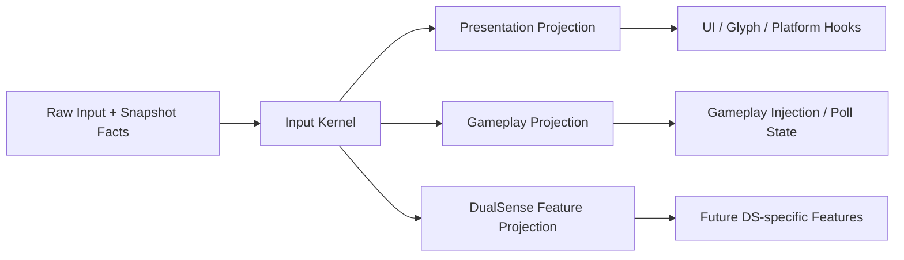

# Input Kernel + Projection Architecture

## Problem Frame

DualPad's current mainline already separates UI/presentation handling from gameplay materialization in broad shape, but the runtime still leaks meaning across those boundaries. `InputModalityTracker` still carries too much responsibility, gameplay ownership still reads ambient tracker-owned facts, and multiple layers still compete to define what "current input mode" means.

The recent CE3 reverse-engineering work suggests a fundamentally different architecture:

- keep one high-resolution internal input-family truth
- publish a separate collapsed presentation surface for UI-facing consumers
- keep gameplay injection on its own projection path
- reserve a dedicated device-specific lane for future DualSense-only behavior rather than overloading generic controller semantics

This brainstorm defines a replacement architecture, not a side experiment. The intended outcome is a new formal mainline architecture that replaces the current one-shot accumulation of tracker logic, compatibility hooks, ownership logic, and backend-local exceptions.

## Requirements

**Architecture Core**
- R1. DualPad must introduce a single authoritative `Input Kernel` that owns the internal high-resolution input-family state for the current frame.
- R2. The `Input Kernel` must keep internal distinctions that are richer than a single `using gamepad` boolean, including at minimum the ability to represent `KeyboardMouse`, `Controller family`, and a device-specific family such as `DualSense`.
- R3. The `Input Kernel` must become the formal source of truth for current input-family interpretation, replacing the current distributed meaning split across `InputModalityTracker`, gameplay ownership code, and backend-local checks.

**Projection Model**
- R4. The new architecture must expose a dedicated `Presentation Projection` that is the only layer allowed to feed UI/platform-facing consumers such as `IsUsingGamepad`, `GamepadControlsCursor`, menu platform refresh, and glyph presentation decisions.
- R5. The `Presentation Projection` must publish a collapsed presentation surface suitable for Skyrim UI semantics and must not expose device-specific details such as DualSense subtype directly to those consumers.
- R6. The new architecture must expose a dedicated `Gameplay Projection` that is the only layer allowed to produce gameplay-visible injection and materialization decisions.
- R7. The `Gameplay Projection` must support per-channel gameplay decisions rather than depending on one coarse global gameplay owner.
- R8. The architecture must reserve a dedicated `DualSense Feature Projection` seam for future device-specific capability propagation, even though that projection is not required to be feature-complete in the first release boundary.

**Mainline Replacement Scope**
- R9. This architecture must be treated as a future replacement mainline, not a permanent parallel path or optional alternate runtime mode.
- R10. The first completed replacement scope must simultaneously cover:
  - UI/platform publication surfaces
  - gameplay injection/materialization surfaces
- R11. The first completed replacement scope must not require future DualSense-specific haptics/trigger work to be complete before it can become the mainline.

**Compatibility and Behavior**
- R12. The first release of the new architecture must prioritize preserving current user-visible behavior wherever possible.
- R13. Known behavior problems that are not required to make the new architecture coherent may remain as explicit TODOs rather than being bundled into the first cutover.
- R14. Skyrim-facing compatibility hooks and published surfaces may continue to exist, but they must become outputs of the new projection model rather than alternate sources of truth.

**Cutover Strategy**
- R15. The intended shipped migration model is a hard cutover to the new architecture rather than a long-lived runtime dual-track system.
- R16. Planning may use temporary implementation shims during development, but the shipped architecture must not preserve two competing formal mainlines.

## Success Criteria
- The project can explain, for any runtime decision, whether it belongs to the `Input Kernel`, `Presentation Projection`, `Gameplay Projection`, or future `DualSense Feature Projection`.
- UI/platform consumers no longer need to understand gameplay ownership details or device-specific family distinctions.
- Gameplay injection no longer needs to read UI-oriented state or tracker-owned ambient truth to decide whether synthetic state should materialize.
- The architecture has a clear place for future DualSense-only behavior that does not require polluting generic controller-family semantics.
- The new architecture is strong enough that planning can treat it as the formal replacement mainline rather than another exploratory branch.

## Scope Boundaries
- This brainstorm does not require the first replacement release to ship full DualSense-specific haptics, trigger, or feature behavior.
- This brainstorm does not define concrete file layout, class names, or migration task ordering in implementation detail.
- This brainstorm does not bundle every currently known gameplay correctness issue into the first release boundary; only architecture-critical behavior belongs in first-cut scope.
- This brainstorm does not prescribe a CE3-style event model wholesale. The imported lesson is the separation of internal truth and outward projections, not a direct copy of CE3 internals.

## Key Decisions
- Replace the current mainline, not run beside it: the new architecture is meant to become the formal primary path.
- First release covers both UI/platform and gameplay: the replacement is not considered successful if it only cleans up one half.
- Preserve behavior before polishing behavior: the first cutover favors compatibility over opportunistic user-facing changes.
- Reserve a dedicated DS-specific lane now, finish DS-specific features later: future capability work must have a clean seam, but it is not required to block the first replacement release.
- Keep the CE3 lesson structural, not literal: the value is in the split between internal truth and outward projections, not in reproducing CE3 classes or event names.

## Dependencies / Assumptions
- The existing snapshot/materialization chain is mature enough to serve as the gameplay-side foundation for the replacement architecture.
- Current CE3 findings are sufficient to justify the high-level split between internal input-family state and outward published surfaces.
- Skyrim still requires compatibility-facing published surfaces such as `IsUsingGamepad`-style answers, even if they are no longer allowed to own the internal truth.

## Outstanding Questions

### Deferred to Planning
- [Affects R1-R8][Technical] Where exactly the boundary should sit between the `Input Kernel` and `PadEventSnapshotProcessor`, and whether the processor should host the kernel or consume it.
- [Affects R4-R6][Technical] Which current `InputModalityTracker` responsibilities should become `Presentation Projection` outputs versus a separate Skyrim compatibility surface.
- [Affects R6-R7][Technical] What the concrete gameplay projection contract should be, including whether it should subsume current ownership, gate-plan, and recovery outputs into one object.
- [Affects R12-R16][Needs research] What validation matrix is required to hard-cut the runtime safely without shipping an accidental behavior regression.
- [Affects R8][Needs research] Which currently known DualSense-specific consumers need a placeholder projection contract in first release even if their behavior remains TODO.

## Next Steps
-> /ce:plan for structured implementation planning
