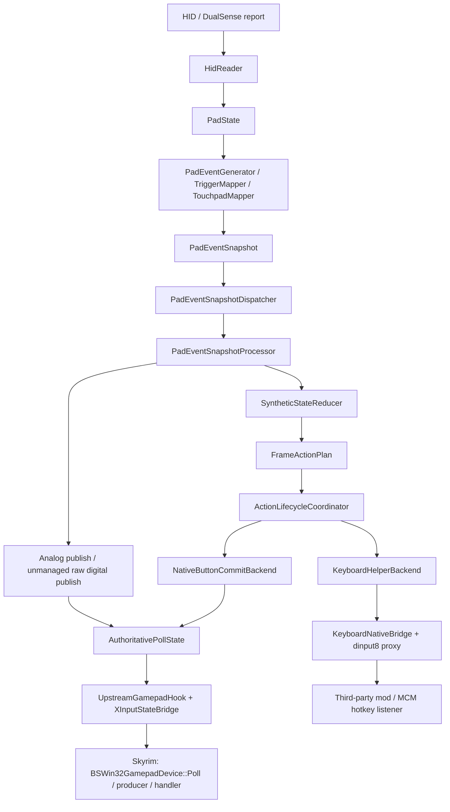

# 当前手柄输入主链路

这份文档只描述 **当前运行时代码** 的正式手柄输入架构，从 `HID` 读取开始，到输入真正进入游戏为止。

它不展开历史实验线，也不讨论已经撤出正式支持面的动作族。

## 一句话版本

当前正式只有两条输出线：

- 原生手柄线：`DualSense HID -> PadState -> PadEventSnapshot -> FrameActionPlan -> AuthoritativePollState -> XInputStateBridge -> Skyrim Poll`
- Mod 事件线：`DualSense HID -> PadEventSnapshot -> FrameActionPlan -> KeyboardHelperBackend -> dinput8 proxy -> 第三方 mod`

其中：

- `AuthoritativePollState` 的正式口径是“虚拟 XInput 手柄硬件状态”
- Skyrim 原生动作语义由游戏自己的 `producer / handler` 继续推导
- `ModEvent / VirtualKey / FKey` 不走原生手柄线，单独走模拟键盘桥

## 总览图

## 1. HID 读取与 `PadState`

入口模块：

- `src/input/HidReader.*`
- `src/input/hid/*`
- `src/input/protocol/*`
- `src/input/state/*`

职责：

- 从 DualSense HID 报文读取原始输入
- 解出统一的 `PadState`
- 保留按钮、摇杆、扳机、触摸板、IMU、电量、传输方式等状态

这一层只做“设备状态读取与归一化”，不做游戏动作解释。

## 2. 映射层与帧级事件快照

入口模块：

- `src/input/mapping/PadEventGenerator.*`
- `src/input/mapping/TriggerMapper.*`
- `src/input/mapping/TouchpadMapper.*`
- `src/input/injection/PadEventSnapshot.*`

输入：

- 单帧 `PadState`

输出：

- 与该 `PadState` 对齐的一份 `PadEventSnapshot`

快照里会带上：

- `PadEventBuffer`
- 当前 raw/down 状态
- 时间戳与序列号
- overflow / coalesced 元数据

映射层当前输出的事件类型包括：

- `ButtonPress`
- `ButtonRelease`
- `AxisChange`
- `Hold`
- `Tap`
- `Combo`
- `Gesture`
- 触摸板点击 / 滑动类事件

这一步的核心目标是：

- 事件顺序与单帧 `PadState` 对齐
- 以整帧快照形式交给后续主线程消费

## 3. 主线程快照传输

入口模块：

- `src/input/injection/PadEventSnapshotDispatcher.*`

职责：

- 把 HID 线程产出的快照安全转交到主线程
- 保证主线程每次处理的是一份完整 `PadEventSnapshot`

当前主线的理解方式是：

- 不是“零散事件一个个直接注入游戏”
- 而是“先形成一帧快照，再进入统一规划与提交流程”

## 4. reduction、绑定解析与动作规划

入口模块：

- `src/input/injection/PadEventSnapshotProcessor.*`
- `src/input/injection/SyntheticStateReducer.*`
- `src/input/backend/FrameActionPlan.*`
- `src/input/backend/FrameActionPlanner.*`
- `src/input/backend/ActionBackendPolicy.*`
- `src/input/backend/ActionLifecycleCoordinator.*`
- `src/input/ActionDispatcher.*`

这一步内部依次发生几件事：

1. `SyntheticStateReducer` 根据 raw state 与 event list 形成 `SyntheticPadFrame`
2. `BindingResolver` 按当前 `InputContext` 把 trigger 解析成 `actionId`
3. `FrameActionPlanner` 结合 `ActionBackendPolicy` 生成 `PlannedAction`
4. `ActionLifecycleCoordinator` 为 `Hold / Repeat / Toggle / Axis` 这类动作补齐生命周期
5. `ActionDispatcher` 把动作分发到正式后端

当前 `FrameActionPlan` 是运行时合同，描述的是：

- 哪个动作
- 走哪个 backend
- 属于什么 contract
- 当前 phase 是什么
- 对应哪种 native code 或键盘 helper 输出

## 5. 两类正式后端

### 5.1 原生手柄数字提交

入口模块：

- `src/input/backend/NativeButtonCommitBackend.*`
- `src/input/backend/PollCommitCoordinator.*`

职责：

- 接收已经规划好的 native digital action
- 处理 `Pulse / Hold / Repeat / Toggle` 的 Poll 可见性
- 把动作 materialize 成标准手柄硬件按钮位

这里的关键点是：

- 它不直接把“游戏动作名字”塞给桥接层
- 它负责的是“把动作提交成虚拟手柄硬件按钮状态”

例如：

- `Game.Jump` 最终 materialize 成 `Triangle`
- `Menu.Confirm` 最终 materialize 成 `Cross`
- `Game.Pause` 最终 materialize 成它固定的 combo ABI

### 5.2 Mod 键盘事件输出

入口模块：

- `src/input/backend/KeyboardHelperBackend.*`
- `src/input/backend/KeyboardNativeBridge.*`
- `tools/dinput8_proxy/*`

职责：

- 处理 `ModEvent / VirtualKey / FKey / 固定虚拟键池`
- 通过 `dinput8` 代理桥把模拟键盘事件交给第三方 mod

这条线与原生手柄线完全解耦，不进入 `AuthoritativePollState`。

## 6. 模拟量与未接管数字位发布

入口模块：

- `src/input/injection/PadEventSnapshotProcessor.cpp`
- `src/input/AuthoritativePollState.*`

除了 `NativeButtonCommitBackend` 产生的 committed digital state 之外，`PadEventSnapshotProcessor` 还负责把另外两类事实发布到统一最终状态：

- 绑定后仍需要写入原生手柄硬件状态的模拟量
  - 左摇杆
  - 右摇杆
  - 左扳机
  - 右扳机
- 未被动作系统接管的 raw digital edge
  - 以 `unmanaged raw digital` 的形式补写进最终状态

这里的含义是：

- 数字键如果被 action 接管，就以 committed 结果为准
- 数字键如果没有被 action 接管，仍可作为原始手柄位进入最终虚拟手柄状态
- 模拟量则主要按绑定解析结果决定是否写入最终状态

## 7. `AuthoritativePollState`

入口模块：

- `src/input/AuthoritativePollState.*`

这是当前原生手柄线的唯一最终状态对象。

它承载的不是“插件侧动作表”，而是“虚拟 XInput 手柄硬件状态”。

当前它汇总的主要内容包括：

- committed digital state
- unmanaged raw digital edges
- `wButtons`
- `bLeftTrigger / bRightTrigger`
- `sThumbLX / sThumbLY / sThumbRX / sThumbRY`
- `pressed / released / pulse`
- `managedMask`
- `context / contextEpoch`
- `pollSequence / sourceTimestampUs`
- `overflowed / coalesced`

设计原则是：

- 所有原生手柄输出先统一收敛到这里
- bridge 层只读它，不再重新解释动作语义

## 8. 进入游戏：`XInputStateBridge`

入口模块：

- `src/input/injection/UpstreamGamepadHook.*`
- `src/input/XInputStateBridge.*`

流程：

1. `UpstreamGamepadHook` 挂到 `BSWin32GamepadDevice::Poll` 的 upstream call-site
2. Poll 时先推进当前帧的 commit
3. `XInputStateBridge` 读取 `AuthoritativePollState`
4. 把它序列化成最终 `XINPUT_STATE`
5. Skyrim 再用它自己的原生链去推导 user event

也就是说，进入游戏时我们交付的是：

- 标准 XInput 硬件按钮位
- 标准摇杆值
- 标准扳机字节

而不是：

- 插件自己造的一套 `Jump / Sprint / Attack / Menu` 事件队列

## 9. 为什么这套结构更稳

当前主线的核心边界是：

- 插件负责 materialize “虚拟手柄硬件状态”
- Skyrim 自己负责解释“这个硬件状态在当前上下文下意味着什么”

这对三类输入都成立：

### 数字键

- 由 `NativeButtonCommitBackend` 负责 lifecycle 和 Poll 可见性
- 最终落成标准手柄按钮位

### 摇杆

- 作为二维模拟量直接进入最终状态
- 交给游戏原生 `Move / Look / MenuStick` producer 处理

### 扳机

- 作为标准 `LT / RT` 字节进入最终状态
- 交给游戏原生的阈值归一化、trigger producer、`AttackBlockHandler` 处理

所以当前主线不是“插件自己重做 Skyrim 的动作系统”，而是“插件稳定生成一份游戏能理解的虚拟手柄硬件包”。

## 10. `ControlMap` 在链路里的位置

对原生手柄线来说，`ControlMap` 仍然是游戏侧 user event 解释的重要一环。

当前 DualPad 会在 `kDataLoaded` 后：

- 读取 `Data/SKSE/Plugins/DualPadControlMap.txt`
- 直接调用游戏自己的 `ControlMap` parser / rebuild 链重载 gamepad 映射
- 故意跳过 `ControlMap_Custom.txt`

相关模块：

- `src/input/ControlMapOverlay.*`

这意味着：

- DualPad 自己维护 gamepad ABI
- 玩家或其它 mod 的 gamepad remap 不再是兼容目标
- 但 Skyrim 最终如何把某个 `wButtons` 解释成原生 user event，仍由游戏自己的 `ControlMap + handler` 决定

## 11. 当前正式支持面的理解方式

当前运行时只建议这样理解：

### 正式原生线

- 标准手柄按钮 current-state
- 摇杆 / 扳机
- 少量已验证可用的 combo-native 原生事件

### 正式 mod 线

- `ModEvent1-24`
- `VirtualKey.*`
- `FKey.*`

### 不再作为当前正式主线推进的方向

- 旧 keyboard-native 主线
- 旧 native-button splice
- 直接把 PC 键盘独占菜单打开动作继续硬压进模拟键盘 helper

## 12. 调试时怎么理解“事件有没有进游戏”

当前最实用的判断方式是：

1. 看 `PadEventSnapshot` 是否已经生成正确事件
2. 看 `FrameActionPlan` 是否已经规划出正确 backend/native code
3. 看 `AuthoritativePollState` 是否已经出现目标按钮位/轴值
4. 再区分：
   - 如果是原生手柄线：问题多半在游戏自己的 `ControlMap / producer / handler`
   - 如果是 mod 线：问题多半在 `KeyboardHelperBackend / dinput8 proxy / 第三方 mod`

所以这套架构下，“没生效”不再等于“映射层没出事件”，而要看它卡在这四层里的哪一层。
