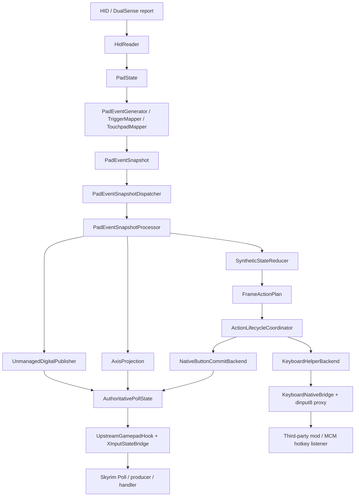

# 当前输入主链路

本文只描述当前代码中的正式运行时链路，不再展开已经退役的 `keyboard-native`、旧 `native button splice` 或 compatibility fallback 主线。

## 一句话版本

当前正式只保留两条输出线：

- 原生手柄线：
  `HidReader -> PadState -> PadEventSnapshot -> FrameActionPlan -> AuthoritativePollState -> XInputStateBridge -> Skyrim Poll`
- Mod 事件线：
  `PadEventSnapshot -> FrameActionPlan -> KeyboardHelperBackend -> dinput8 proxy -> third-party mod`

其中：

- `AuthoritativePollState` 的正式语义是“虚拟 XInput 手柄硬件状态”。
- Skyrim 原生 user event 尽量交给游戏自己的 `producer / handler` 从这份硬件状态推导。
- `ModEvent / VirtualKey / FKey` 不进入原生手柄线。

## 主链路

## 分层说明

### 1. HID / PadState

入口模块：

- `src/input/HidReader.*`
- `src/input/hid/*`
- `src/input/protocol/*`
- `src/input/state/*`

职责：

- 读取 DualSense HID 报文。
- 归一化为单帧 `PadState`。
- 保留按钮、摇杆、扳机、触摸板、IMU、电量、传输方式等原始事实。

这一层不理解 Skyrim 动作语义。

### 2. 映射层与帧级快照

入口模块：

- `src/input/mapping/*`
- `src/input/injection/PadEventSnapshot.*`

职责：

- 从单帧 `PadState` 生成与该 snapshot 对齐的一份 `PadEventSnapshot`。
- 输出 `ButtonPress / ButtonRelease / AxisChange / Hold / Tap / Combo / Gesture / Touchpad` 相关事件。

当前口径：

- 事件顺序与单帧 `PadState` 对齐。
- 通过 `PadEventSnapshotDispatcher` 以整份 snapshot 交给主线程消费。
- producer 侧已经形成单帧原子 snapshot，但主线程交付仍是异步 drain。
- 当 backlog 超过单次 Poll 预算时，dispatcher 允许 latest-state coalescing；因此当前不是“绝不异步、绝不 coalesce 的逐原始帧直通”。

### 3. 主线程 reduction / plan / lifecycle

入口模块：

- `src/input/injection/PadEventSnapshotProcessor.*`
- `src/input/injection/SyntheticStateReducer.*`
- `src/input/backend/FrameActionPlan.*`
- `src/input/backend/ActionLifecycleCoordinator.*`
- `src/input/ActionDispatcher.*`

职责：

- 把 snapshot 还原成当前帧的 `SyntheticPadFrame`。
- 在当前上下文下解析绑定，生成 `FrameActionPlan`。
- 为 lifecycle-owned 动作显式决定 `Press / Hold / Repeat / Release / Pulse`。
- 将不同动作分发到正确 backend，而不是让 backend 自己重判动作合同。
- `PadEventSnapshotDispatcher` 当前以 bounded drain 方式在主线程消费 snapshot；若 backlog 超过单次 Poll 预算，会把剩余工作收敛为 latest-state coalesced snapshot。

### 4. 原生手柄状态提交

这层分成三部分：

- `NativeButtonCommitBackend`
  - 负责标准手柄数字位的 planner-owned commit。
- `AxisProjection`
  - 负责摇杆 / 扳机等模拟量投影。
- `UnmanagedDigitalPublisher`
  - 负责未被 action 接管的 raw digital 位补写。

它们共同写入：

- `AuthoritativePollState`

`AuthoritativePollState` 当前只承载统一虚拟手柄硬件状态与少量调试元数据，不再预存 XInput transport 派生字段。

### 5. XInput bridge

入口模块：

- `src/input/injection/UpstreamGamepadHook.*`
- `src/input/XInputStateBridge.*`
- `src/input/XInputButtonSerialization.*`

职责：

- 在 `BSWin32GamepadDevice::Poll` 的 upstream `XInputGetState` call-site 先 drain pending snapshot，再 commit native digital state，最后写入 synthetic XInput state。
- `XInputStateBridge` 只做 transport 侧序列化。
- `wButtons` 派生由 `XInputButtonSerialization` 在 bridge / debug 侧按需计算。

当前桥接层不再承担 gameplay 语义补做。

当前偏差说明：

- use_upstream_gamepad_hook=false 仍作为开发/排障期 rollback gate 保留，不是当前推荐主线。
- InputFramePump 在 upstream poll activity stale 时仍会做一次 assist drain；这属于当前过渡兼容行为，不等于正式单点 drain seam 已完全收口。
- 因此，当前 repo reality 已经有推荐主线，但还没有达到除主线外零额外执行分叉的最终收口状态。

当前 route-health 合同：

- `route_state` 当前只允许 `active_fresh`、`active_stale`、`disabled`。
- `active_fresh`：official upstream route active，且 `last_poll_age_ms <= 250`；当前对应的正式 `drain_reason` 是 `upstream_poll`。
- `active_stale`：official upstream route active，但 poll activity 已超过 250ms 或尚未观察到 recent poll；当前兼容下仍允许 `frame_pump_assist_stale`，high-water task fallback 也必须带着当次实际 `route_state` 记录。
- `disabled`：official upstream route inactive；当前 fallback drain 仍允许存在，但必须显式记为 `frame_pump_disabled`，不能再混成“普通 manual drain”。
- `drain_reason` 当前冻结为：`upstream_poll`、`frame_pump_assist_stale`、`task_fallback_high_water`、`frame_pump_disabled`。
- 若 `DualPadDebug.ini` 里开启 `log_route_health=true`，route-health 诊断日志至少要输出：`route_state`、`drain_reason`、`last_poll_age_ms`、`hook_installed`、`budget`、`drained`、`pending_before`、`pending_after`。

### 6. Keyboard helper / Mod 事件线

入口模块：

- `src/input/backend/KeyboardHelperBackend.*`
- `src/input/backend/KeyboardNativeBridge.*`
- `tools/dinput8_proxy/*`

职责：

- 处理 `ModEvent1-24`、`VirtualKey.*`、`FKey.*`。
- 通过 simulated keyboard route 对接第三方 mod / MCM 热键监听器。

这条线不承担 Skyrim PC 原生事件主线。

## 菜单上下文与表现层侧支

这条输入主链之外，当前还有两条和菜单表现直接相关的侧支：

- `ContextEventSink -> ContextManager -> InputModalityTracker`
- `ContextEventSink -> ScaleformGlyphBridge`

其中：

- `MenuContextPolicy + InputContextNames + DualPadMenuPolicy.ini`
  - 负责未知菜单是否抢上下文，以及应该映射到哪个 `InputContext`
- `ScaleformGlyphBridge`
  - 负责把 `action/context` 解析成当前 SWF 可消费的 glyph token / descriptor

这两条侧支不会改写主链的手柄硬件 materialization，但会影响：

- 当前菜单逻辑上下文
- UI 平台表现
- 主菜单等页面的动态图标查询结果

对应文档：

- [menu_context_policy_current_status_zh.md](menu_context_policy_current_status_zh.md)
- [main_menu_glyph_current_status_zh.md](main_menu_glyph_current_status_zh.md)

## 当前正式原则

- `FrameActionPlan` 是运行时合同，不是影子日志。
- planner 决定动作合同，backend 只消费已决定的动作事实。
- 原生线优先 materialize 标准手柄硬件位 / 轴，而不是在插件里重做 Skyrim 原生 handler 语义。
- `ControlMap` overlay 只用于少量 keyboard-exclusive native event 的固定 gamepad ABI，不改变当前“双主线”结构。
- `Pause / NativeScreenshot` 当前已验证可用；`OpenInventory / OpenMagic / OpenSkills / OpenMap` 已撤出正式支持面。
