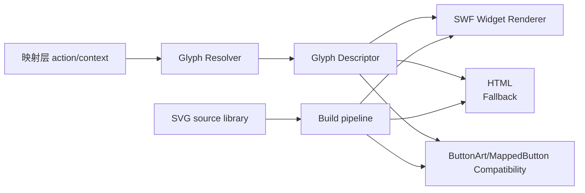

# 动态图标统一 SVG 系统方案

这份方案是对之前 `SWF` 分页 patch 尝试的重新收口。新的目标不是“继续为每个页面找一条临时替换链”，而是先定义一套**统一的动态图标系统**，再让各个页面按自己的能力去消费它。

核心前提：

- 图标真相源始终是**映射层**，不是 `controlmap`。
- 后续手柄键位不再假设都长得像 `A/B/X/Y`。
- 按键图标将出现：
  - 不同大小
  - 不同宽高比
  - 不同外形
  - 组合键
- 用户提供的是 **SVG 真源**，项目内部负责做规范化和导出，不再要求手工准备多套 PNG/DDS。

## 方案结论

最终要做的是一套 **“语义层 -> 图标描述层 -> 渲染层”** 的三段式系统：



一句话：

- **映射层决定显示什么**
- **SVG 资产决定长什么样**
- **每个页面决定用哪种渲染方式**

## 为什么要换方案

之前的做法最大的问题不是“单页 patch 不够努力”，而是**承载层不统一**。

历史上我们已经踩到过几类典型问题：

- `startmenu` 更像按钮控件 / sprite 路线，效果最好。
- `quest_journal / map` 更像 `MappedButton / buttonArtDD` 家族。
- `hudmenu / tutorialmenu` 本质是 `HTML ` 文本槽位。
- `favoritesmenu` 这种 SkyUI 特例页，显示和输入不是一回事。

这意味着：

- 不能假设所有页面都适合一个 `ButtonArt token` 链。
- 不能假设所有按键都能塞进 `64x64` 正方形。
- 不能假设组合键只要拼一个原生 token 就够了。

所以新的方案必须先把“图标长什么样”和“页面怎么显示”彻底拆开。

## 新系统的三层结构

## 1. 语义层：Glyph Resolver

这一层只负责回答：

- 某个页面当前要显示的 action 是什么
- 在当前映射下，它应该显示哪个键
- 这个键对应哪种图标类型

输出不再只是简单 `360_Y / PS3_A` 这类 token，而是统一的 `GlyphDescriptor`。

建议的核心字段：

```cpp
struct GlyphDescriptor
{
    std::string semanticId;      // 例如 Menu.Confirm / Journal.XButton
    std::string glyphId;         // 例如 face.cross / back.left / combo.face.square+back.left
    std::string shapeClass;      // 例如 face_round / shoulder_wide / trigger_tall / combo_cluster
    std::string label;           // 人类可读标签，例如 Cross / BackLeft
    bool isCombo;
    std::vector<std::string> parts;  // 组合键时的子图标列表
    float preferredAspect;       // 推荐宽高比
    float preferredScale;        // 推荐默认尺寸倍率
};
```

这里的关键点是：

- **`glyphId` 是视觉语义**
- 不是“原生 token”
- 也不是“物理键码”

例如：

- `face.cross`
- `face.triangle`
- `shoulder.l1`
- `back.left`
- `fn.right`
- `combo.face.square+back.left`

## 2. 资产层：SVG 真源 + 导出规范

新的资产规则：

- 用户只需要给 SVG
- 项目内部统一规范化 SVG
- 再按需要导出不同用途的 PNG / SWF 内嵌位图

### 资产真源

建议目录：

- `art/glyph_svg/face/`
- `art/glyph_svg/shoulder/`
- `art/glyph_svg/system/`
- `art/glyph_svg/custom/`

每个 SVG 只表达**一个完整按钮**，不是只给中间符号。

也就是：

- 图标本体
- 边框/底座
- 留白/padding

都在 SVG 里一起定义。

这样以后：

- 主菜单
- HUD
- 教程
- 日志页

都能从**同一个完整按钮真源**导图，而不是一页用符号、一页用边框、一页再拼一次。

### SVG 规范化

构建时统一做：

- 清理成标准 `viewBox`
- 去除异常 transform
- 锚点归一化
- 透明边距控制

这是因为之前直接从 SWF/FFDec 导出来的 SVG 容易有：

- viewport 不标准
- 内容裁切
- 位置不稳定

### 导出档位

新的导出不要再围绕“原版 64x64 规格是最终标准”来设计，而是围绕**不同渲染链的需要**来准备：

- `swf_bitmap_128`
- `swf_bitmap_256`
- `swf_bitmap_512`
- `html_img_128`
- `html_img_256`
- `external_dds_64`

解释：

- `SWF` 内嵌位图链：优先 `128/256/512`
- `HTML `：优先 `128/256`
- 只有为了兼容原生外部 `Exported/*.dds` 时，才额外出 `64x64`

### DDS 的地位

新的方案里：

- `DDS` 不是主资产格式
- 只是旧链兼容物

主资产流程是：

- `SVG -> normalized SVG -> PNG`

只有在老资源链必须吃 DDS 时，才额外导出 DDS。

## 3. 渲染层：三种消费方式

新系统不再要求每页都用同一种显示方式，而是分三层：

### A. Widget Renderer

这是**长期主路线**。

做一个真正的 `DualPadGlyphWidget`，用于可以承载自定义控件的页面。

建议结构：

```cpp
DualPadGlyphWidget
├─ Border / Background
├─ GlyphImage or GlyphParts
├─ OptionalText
└─ ComboSeparator / ModifierLayer
```

它要支持：

- 正方形按钮
- 宽按钮
- 高按钮
- 组合键并排显示
- 将来更复杂的特殊键

这条路线最适合：

- `startmenu`
- `sleepwaitmenu`
- `quest_journal`
- `map`
- 以后新的自定义页面

### B. HTML `` Fallback

这是**兼容路线**，不是最终形态。

适合：

- `hudmenu`
- `tutorialmenu`
- 这类本来就是文本槽位 / HTML 图片链的页面

做法是：

- 仍然让页面用原生 `HTML `
- 但图源来自统一 SVG 导出
- 并按页面实际显示尺寸准备专用 PNG

这条链有两个限制：

- 清晰度上限受 GFx/HTML 采样影响
- 不适合复杂组合键和极端异形键

所以它只作为：

- 短中期稳定方案
- 特殊页面 fallback

### C. 原生 ButtonArt / MappedButton 兼容层

这层继续保留，但只作为兼容，不作为未来总方案。

适合：

- `quest_journal`
- `map`
- 一些复用 `buttonArtDD` 的页面

原则是：

- 标准面键仍可映射到现有按钮码
- 但一旦遇到异形键 / 组合键，就要切回 Widget Renderer

也就是说：

- `ButtonArt` 是 compatibility layer
- 不是最终承载层

## 组合键方案

组合键不能继续当成“一个单独 token”的偶然情况，而要成为系统第一类能力。

建议 `GlyphDescriptor` 里明确：

- `isCombo = true`
- `parts = ["face.square", "back.left"]`

然后由渲染层决定显示方式：

### Widget Renderer 下

直接运行时拼：

- 左按钮
- 分隔符（`+`、`/` 或叠层）
- 右按钮

优点：

- 尺寸可控
- 锚点可控
- 宽按钮和圆按钮可以混排

### HTML `` 下

只对简单组合键做预合成：

- `combo_face_square_back_left.png`

复杂组合键不建议走这条链，直接 fallback 为：

- 文本
- 或简化标记

## 页面分层策略

为了避免重新掉进“每页单独猜链路”的坑，这次先明确页面分层：

### 第一层：Widget 主线页

优先迁到真正的 `DualPadGlyphWidget`：

- `startmenu`
- `sleepwaitmenu`
- `quest_journal`
- `map`
- `dialoguemenu`

这批页的目标是：

- 先把面键跑顺
- 再支持异形键
- 最后支持组合键

### 第二层：HTML fallback 页

- `hudmenu`
- `tutorialmenu`

这批页先维持稳定，但文档上明确它们只是 fallback，不是最终标准。

### 第三层：SkyUI 特例页

- `favoritesmenu`
- 其它显示/输入严重分离的页面

这批页要单独看显示层结构，不拿它们当系统路线参考页。

## 为什么这套方案能兼容“大小不一、形状不一、组合键”

因为它不再把“图标”绑定到原版的：

- `64x64`
- `PS3_A`
- `360_Y`
- `ButtonArt token`

而是改成：

- 映射层给语义
- SVG 给图形
- 渲染器决定怎么放

只要 `GlyphDescriptor` 足够稳定：

- 圆形面键
- 宽肩键
- 高扳机
- 背键
- 组合键

都只是不同的 `shapeClass + parts`，不会再逼迫项目去复用错误的原生链。

## 具体实施顺序

### Phase 1：定资产和描述层

- 建立统一 SVG 源目录
- 落 `GlyphDescriptor` 结构
- 建 SVG 规范化脚本
- 建 `128/256/512` PNG 导出脚本

### Phase 2：先做一个最小 Widget

- 实现 `DualPadGlyphWidget`
- 先只支持四个面键
- 接到一个最干净的页面

推荐从：

- `startmenu`

开始，因为它本来就是当前参考样式。

### Phase 3：迁移 `quest_journal / map / sleepwait`

- 让这几页不再依赖临时 token 拼接
- 开始统一到 Widget 路线

### Phase 4：HUD/Tutorial 保持 fallback

- 继续走 `HTML `
- 使用同一批 SVG 导出的 PNG
- 只做稳定性和清晰度优化

### Phase 5：组合键支持

- 先在 Widget 层支持运行时拼装组合键
- 再决定是否为 HUD 这种页面提供预合成图片

## 当前落地建议

当前最合理的决策是：

- **正式真源：SVG**
- **正式长期承载层：Widget / sprite**
- **HTML ``：保留为 HUD/Tutorial fallback**
- **ButtonArt / MappedButton：保留为兼容层**

也就是说，后面不要再把：

- `64x64 DXT3`
- `ps3_a.png`
- `360_y token`

当成最终系统设计，而要把它们看作：

- 旧页面兼容口
- 不是总方案

## 这版方案对应的工作边界

你后面提供 SVG 时：

- 你只管给 SVG 真源
- 我负责：
  - 规范化 SVG
  - 导出不同档位 PNG
  - 接到 SWF / Widget
  - 做页面侧渲染适配

所以后续的资产流程应该固定成：

**用户给 SVG -> 项目规范化 -> 项目导出 -> 页面消费**

而不是：

**用户先做多套 PNG/DDS -> 页面各自乱用**
