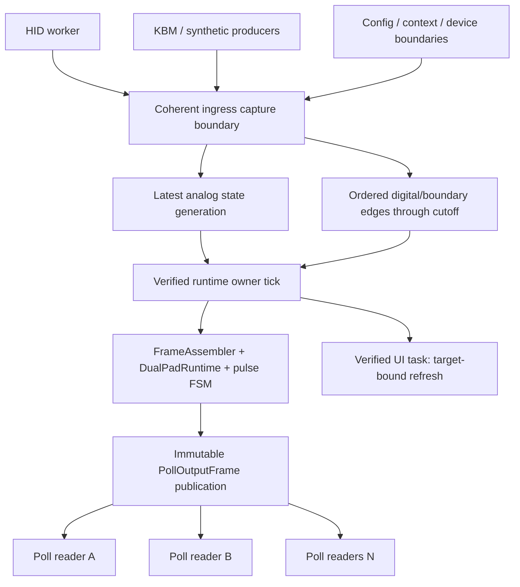
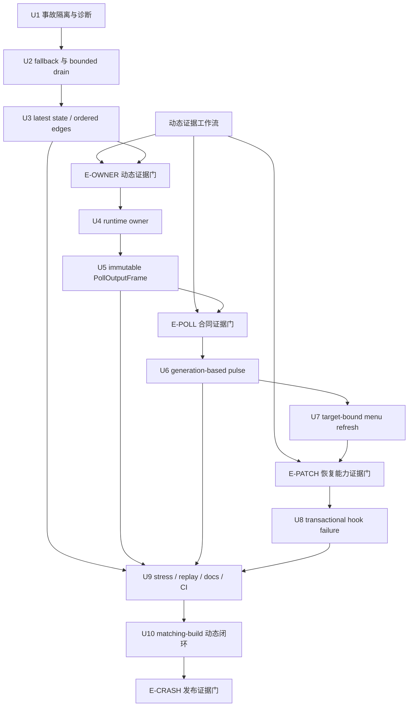
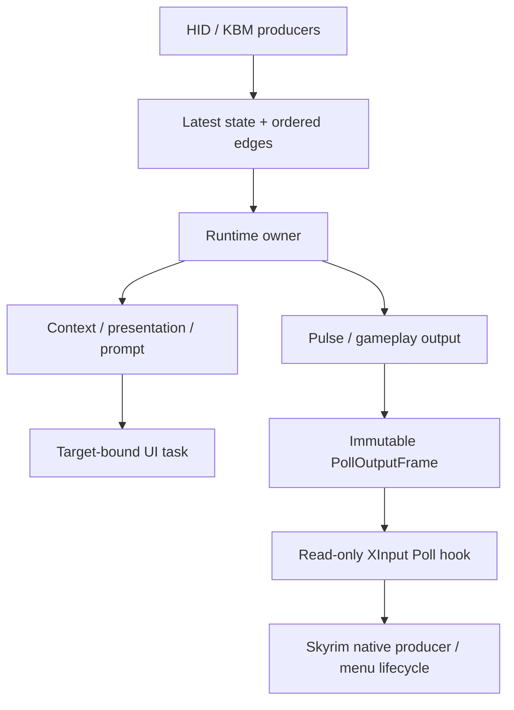

# fix: 收口 RC20 输入实时性与 Favorites 崩溃路径

## 概览

本计划在 `codex/dp5-rc20-menu-native-hotfix` 分支上推进一个新的 DP5 post-closeout field-readiness hotfix slice。它不是新的 runtime phase，也不重开 PH8a 已完成的 `src/input_v2/` 主线裁决。

本轮同时处理两个 RC20 发布阻塞问题：

1. 高频 HID 输入经过共享有界队列、错误 fallback 调度和伪预算 drain 后形成积压、突发处理、overflow 与摇杆跳变。
2. `Game.Favorites` 通过 synthetic XInput DPadUp 输出后，Skyrim 在 `FavoritesMenu` observer 建立前闪退；现有日志能限定崩溃窗口，但没有与当前构建匹配的符号化 dump，不能声称已定位具体 faulting instruction。

目标运行时固定为：

```text
HID producer
  └─ coherent ingress transaction
       ├─ LatestPadState publication（连续量 latest-wins）
       └─ OrderedEdgeQueue（数字/边界按序）

Verified runtime owner tick
  -> capture latest-state generation + bounded edge cutoff
  -> assemble deterministic frame
  -> resolve context / actions / pulse
  -> publish immutable PollOutputFrame

XInput Poll hook
  -> acquire one immutable PollOutputFrame
  -> serialize one XINPUT_STATE
  -> return
```

在完成真实 Skyrim 循环测试、匹配构建的 crash dump 闭环和 IDA 调用合同前，native `Game.Favorites` 默认保持关闭。当前发布判断为 `NO-GO`。

## 问题框架与当前代码事实表

下表只记录已经在当前 HEAD `5f920307acd0fd01180fb37c9094bf2ac0d6600d` 复核到的代码事实。实机调用时钟和 crash faulting stack 单独列为待验证事项。

| ID | 当前代码事实 | 证据位置 | 证据等级 |
| --- | --- | --- | --- |
| F1 | `ShouldForceTaskFallback()` 已存在，但 `SubmitSnapshot()` 的实际 high-water 调度条件没有调用它；`active_fresh` 仍会仅因 pending 达阈值排 task。 | `src/input/injection/PadEventSnapshotDispatcher.cpp` | 代码已证明 |
| F2 | `DrainOnMainThread(maxSnapshots)` 和 `DrainForReplay(maxSnapshots)` 都直接调用 `IngressHub::Drain()`；参数没有限制实际 event drain。 | `src/input/injection/PadEventSnapshotDispatcher.cpp`, `src/input_v2/ingress/IngressHub.cpp` | 代码已证明 |
| F3 | dispatcher 的调度阈值使用 legacy snapshot count，实际容量和 drain 使用 ingress event count，日志中的 budget 返回 frame count。 | 同上 | 代码已证明 |
| F4 | 每份 legacy snapshot 至少产生 `UiSnapshot + PadSnapshot`；`BuildControlSamples()` 固定追加 6 个轴/扳机样本，source evidence 还会作为 ordered event 入队。 | `src/input_v2/ingress/LegacyIngressAdapter.cpp`, `src/input_v2/ingress/LiveInputFactProducer.cpp` | 代码已证明 |
| F5 | overflow 会清空整个 `_queue`，只保留 `QueueOverflow` marker；metadata 明确记录 dropped control samples、pulse ledger 和 legacy snapshot。 | `src/input_v2/ingress/IngressHub.cpp` | 代码已证明 |
| F6 | upstream Poll thunk 内执行 ingress drain、runtime/context refresh、`CommitPollState()` 与 XInput serialization。 | `src/input/injection/UpstreamGamepadHook.cpp`, `src/input/injection/PadEventSnapshotDispatcher.cpp` | 代码已证明 |
| F7 | `DeferredPulse` 在每次 `CommitPollState()` 中执行 `BeginFrame -> Tick -> Flush`；`minDownMs=0` 时第 2 次 Poll 可推进 release。 | `src/input/backend/NativeButtonCommitBackend.cpp`, `src/input/backend/PollCommitCoordinator.cpp`, `tests/NativeButtonCommitTests.cpp` | 代码已证明 |
| F8 | `AuthoritativePollState` 用多个独立 atomic 字段发布一个逻辑帧；`ReadSnapshot()` 无 generation coherence。 | `src/input/AuthoritativePollState.*` | 代码已证明 |
| F9 | `XInputStateBridge` 的 `g_lastSnapshot` / `g_hasLastSnapshot` 为普通全局可变状态，packet number 由 reader 竞争更新。 | `src/input/XInputStateBridge.cpp` | 代码已证明 |
| F10 | `ContextResolver` 写 `_published` 时无同步，并返回包含 `string`、`vector`、`optional` 的内部 const reference。 | `src/input_v2/context/ContextResolver.*` | 代码已证明 |
| F11 | `LiveInputFactProducer` 由 HID、键盘、鼠标和 synthetic keyboard 多入口共享 `_previousDownMask`、`_downAtUs`、collector 与 publisher，未声明同步或单写合同。 | `src/input_v2/ingress/LiveInputFactProducer.*`, `src/input/InputFramePump.cpp` | 代码已证明 |
| F12 | menu refresh request 只携带 serial、epoch 和字符串 key；执行端遍历整个 `RE::UI::menuStack` 并调用每个 ready menu 的 `RefreshPlatform()`。 | `src/input_v2/presentation/SkyrimCompatibilitySurface.*` | 代码已证明 |
| F13 | `IsFailClosedStatus()` 对全部 `HookInstallStatus` 返回 false；partial patch 不回滚已写入的 branch/vfunc。 | `src/input_v2/presentation/SkyrimCompatibilitySurface.cpp` | 代码已证明 |
| F14 | 现场日志在 `Game.Favorites -> DeferredPulse -> XInput 0x0001` 后结束，没有 `FavoritesMenu` observer；pre-output presentation handoff 和 HID thread lifecycle hardening 都已实机证伪为完整根因。 | `.dualpad-builder/progress.md` | 日志已证明窗口，未证明 faulting instruction |
| F15 | Poll thunk 日志出现多个 OS thread ID。是否真正并发、每帧调用次数、qualifying consumer 与调用生命周期仍未知。 | 用户提供的目标与计划包 | 必须用 IDA / debugger / 新诊断验证 |

## 根因假设分级

### 已由代码和日志证明

- 摇杆路径的直接结构性根因是「连续状态与有序事件混流 + event amplification + 错误 fallback 调度 + 无效 drain budget + overflow 删除 latest axis」。
- Poll hook 当前不是只读 adapter，而是 runtime scheduler 和 pulse clock。
- logical snapshot publication 目前存在撕裂或 reader-side data race 风险。
- Favorites 崩溃发生在 synthetic DPadUp 被游戏看到之后、插件观察到稳定 `FavoritesMenu` 之前。

### 高概率推断

- 摇杆停顿/跳变来自 backlog 突发 drain 和 overflow recovery，而不是单纯滤波阈值。
- Favorites 崩溃可能被错误线程上的 runtime/UI mutation、Poll-call pulse cadence、torn publication 或菜单临界区访问触发；这些风险必须先移除，再判断游戏/SWF 是否仍有独立问题。

### 尚需 IDA / dump / 实机验证

- `0xC1AB40` / `0xC1AB9D` 的完整 caller graph、调用线程、每帧调用次数和 qualifying consumer 定义。
- synthetic DPadUp 到 Favorites user event、menu show、constructor、movie load 和 handler registration 的游戏内部顺序。
- 当前闪退的 exception code、faulting instruction、faulting thread stack 及其所属模块。
- vanilla 与 live `favoritesmenu.swf` 是否存在行为差异。

## 需求追踪

- R1. `src/input_v2/` 保持唯一 runtime mainline；legacy-named dispatcher、processor、snapshot 与 bridge 只保留 compat / adapter / replay 职责。
- R2. native `Game.Favorites` 必须有独立 fail-closed feature gate；实机闭环前默认关闭，且单次物理输入不得同时走 native 与 fallback。
- R3. fallback 调度必须只有一个 truth-table 函数；`active_fresh` 不因 high-water 启动第二 consumer。
- R4. pending / capacity / high-water / hard drain cap 必须统一使用 event 单位；可额外设置 deadline 作为更早停止条件，但不能取代 event hard cap 或改变计数单位。
- R5. 连续状态改为完整同代的 latest-value publication；有序队列只保留 edge、pulse request、reset、device、reload、context/presentation boundary。
- R6. runtime mutation 必须由经过验证的唯一 owner tick 推进；错误线程或 owner 漂移必须 fail-closed。
- R7. `PollOutputFrame` 必须完整、不可变且具备 reader lifetime ownership；Poll hook 一次只 acquire 一个 frame。
- R8. pulse 生命周期只按 runtime generation 推进；Poll reader 不得改变 pulse 状态，同一 output generation 的 1 次或 20 次 Poll 结果一致。
- R9. menu refresh 必须绑定 target menu / instance / revision / epoch，并在执行时复验；不得无差别刷新整个 menu stack。
- R10. hook install operational state、failure disposition 和 partial rollback 必须一致、可测试、fail-closed。
- R11. 每个实施单元先增加 characterization / failing test，再做最小实现；必须覆盖 host stress、concurrent readers、replay、property 和 fuzz regression。
- R12. 没有真实 Skyrim 循环、匹配 dump 与动态调用合同闭环时，最终状态不得为完全 `GO`。

## 范围边界

- 不新增 PH9 或其他历史 phase；本轮属于 DP5 post-closeout field-readiness hotfix。
- 不恢复旧 `FavoritesMenu` repo-owned workspace，不在没有 A/B 证据时修改 ActionScript。
- 不新增最终图标视觉资产，不实现 haptics / vibration。
- 不通过扩大队列、增加 sleep 或单纯延长 pulse 时间掩盖时钟和所有权错误。
- 不改变与本目标无关的绑定语义、用户配置或旧 SWF 返回 shape。
- 不恢复 keyboard-native、direct `BSInputEventQueue` 或旧 native splice 为 runtime authority。
- IDA、WinDbg / Visual Studio、JPEXS 证据是独立交付物；未执行项必须显式保留为 blocker。

## 本地研究与项目惯例

### 技术与基础设施

- C++23、CommonLibSSE-NG、SKSE plugin，唯一正式支持 Skyrim SE 1.5.97。
- xmake 3.0.7 是本机与 CI 固定版本；构建目标由 `xmake.lua` 手工维护 source groups。
- canonical runtime targets、Phase8 和 RC readiness outer gate 已存在，不允许用新 wrapper 取代。
- replay root 固定为 `tests/replay/golden/`；Graphify 只做上下文加速。

### 现有模式

- `UiMenuObserver` 已提供 mutex + by-value snapshot，可作为 `ContextResolver` publication 的直接参考。
- `SkyrimCompatibilitySurface::GetCommittedState()` 已采用 mutex + by-value 返回，可作为 dynamic snapshot 生命周期参考。
- `IngressHub` 已有 mutex-serialized producer 边界，可先用 correctness-first 的短临界区实现 latest state / ordered queue。
- `RuntimeConfig` 与 `DualPadDebug.ini` 已提供 release-safe feature/config gate 载体。
- `tests/input_v2/IngressTests.cpp`、`InputV2Tests.cpp`、`PresentationProjectionTests.cpp`、`tests/NativeButtonCommitTests.cpp` 已是相关 focused test 入口。

### 仓库 learnings

- `docs/solutions/` 不存在；repo-local `.learnings/` 是可用的机构记忆。
- `.learnings/ERRORS.md` 记录 focused target 使用手工 source list，新增跨层源文件时必须同步 reusable group 和 replay consumers。
- standalone test 直接构造 `RE::BSFixedString` 曾挂起；pulse/runtime integration 测试应复用已有 harness 或纯合同 surface。
- direct `BSInputEventQueue` 和 keyboard helper 均已被实机证伪为菜单 native route 的正式替代。
- 异步 menu refresh key 必须只包含会产生 refresh-relevant dirty 的字段；target identity 与 stale cancellation 还需在这一原则上补齐。

## 关键技术决策

| 决策 | 选择 | 理由 |
| --- | --- | --- |
| Favorites 默认行为 | 独立 gate，默认 fail-closed；仅当已有 verified fallback 时才允许单路 fallback | 当前没有足以证明 keyboard/direct event 等价安全的证据，双路更危险 |
| Ingress coherent capture | HID report 在同一同步边界提交同源 state generation 与 derived edges；edge-only producer 在同一全局 ingress sequence 下提交。owner capture 显式返回 latest-state generation 与 drained-edge cutoff | bounded drain 允许两者有意不同步；显式双 cutoff 可防止把 future current-down/source/boundary 当成已消费 edge |
| LatestPadState 首版 publication | mutex-protected complete POD snapshot，by-value acquire；模拟量 latest-wins，current-down mask 仅作 overflow recovery baseline | 先保证 C++ 内存模型正确，同时避免 latest snapshot 绕过 ordered digital reducer |
| Ordered edge transport | 有界、明确 event 单位、带 head cursor 的 mutex-serialized ring/deque | 当前 producer 边界已是 mutex；head cursor 避免 repeated front erase 的 O(n²) drain |
| Runtime owner | `BSInputDeviceManager` input pump 仅作候选；先加 identity / cadence 证据和 fail-closed guard | 名称与注册点不能证明线程和生命周期 |
| Poll output publication | owner-rate `atomic<shared_ptr<const PollOutputFrame>>` 或等价 shared immutable ownership | 能直接证明 reader 生命周期；Poll hot path 不分配，禁止朴素双缓冲 |
| Packet number | runtime owner 基于完整 gamepad-visible payload 分配 | reader 不再缓存或比较上一帧，消除竞争写 |
| Pulse release | 仅由 owner generation 推进；E-POLL 必须先证明 owner/Poll ordering，再冻结最小 hold-generation 合同。Poll acquire 只做诊断，不驱动 release | 保持 Poll adapter 无 runtime mutation；无法证明可见性时 native Favorites 保持关闭，而不是用 reader ack 或任意毫秒延时补洞 |
| Overflow recovery | 保留 latest state，冻结 transient；edge history lost 后等待 clean release / generation barrier | current-down mask 可建基线，但不能猜造 press |
| Menu refresh | request 绑定 target name + stable instance + stack/context/presentation revision；执行时复验 | 防止 stale task 触碰替换、半初始化或销毁中的菜单 |
| Hook patch | 启动期 quiescent install + 全站点 preflight + 保存原始字节/位移/vfunc + expected-current restore | trampoline target 不是原始指令字节；无法证明真实 restore 时必须改成单一不可部分提交边界，而不能伪称 transaction |

### 动态证据门

- **E-OWNER（Unit 4 前置）：** 用诊断或 debugger 证明候选 tick 的 thread identity、重入、cadence、启动/退出生命周期；证据不足时只允许 guard + fail-closed，不允许迁移 authority。
- **E-POLL（Unit 6 合同冻结前置）：** 用 IDA/WinDbg 证明 `0xC1AB40` / `0xC1AB9D` caller graph、调用次数、owner/Poll ordering 与 qualifying consumer。证据不足时，Poll acquire 只能产生不参与 runtime 决策的 diagnostics，native Favorites 继续关闭。
- **E-PATCH（Unit 8 写 patch 前置）：** 证明每个 site 可读取、保存并按 expected-current 原子语义恢复原始内容，且安装发生在无并发执行该 site 的启动窗口；否则改用不会产生 partial state 的安装边界。
- **E-CRASH（发布判断前置）：** matching build dump + faulting instruction/stack + SWF A/B + 实机日志形成闭环；host tests、IDA 静态分析或“未再复现”都不能单独解除 Favorites gate。

## 高层技术设计

> 本图用于表达审查方向，不是实现规范。执行者应以当前代码和测试反馈决定最终类型与符号名，不应机械复制图中的命名。



## Flow 与边界分析

### Flow 1：稳定模拟量

- 入口：HID 以 500 / 1000 Hz 发布轴与触发器。
- owner：30 / 60 / 120 Hz 每 tick 只 acquire 一份内部完整的 latest state；其模拟量可领先 bounded edge cutoff。
- 终态：Poll output 始终使用最新 generation；ordered queue 不因纯轴运动增长。
- 失败路径：producer 覆盖旧 state 是预期行为；不得转为 sequence gap 或将轴归零。

### Flow 2：数字 edge 与 overflow

- 入口：按下/释放、reset、device/reload/context boundary 进入 ordered queue。
- 决策：队列完整时严格按序消费；overflow 时发布 `EdgeHistoryLost` / `QueueOverflow` boundary。
- normal path 的 digital reducer 只应用本 tick 已 drain 的 edge；LatestPadState 的 `currentDownMask` 不得绕过 backlog 推进数字状态，只能在 overflow recovery 建立 clean baseline。
- 终态：冻结新 pulse/toggle，保留 latest current-down mask；观察 clean release 后恢复 transient。
- 禁止：从 current-down mask 猜造一次未知 press，或清掉 latest axis。

### Flow 3：runtime owner 与 Poll readers

- owner tick 是唯一 writer；Poll 线程只读同一 immutable publication。
- owner thread 首次绑定、重复调用、线程漂移、owner 入口停止均有明确状态。
- 未完成 owner 动态验证时，native Favorites 保持关闭；错误线程 mutation fail-closed。

### Flow 4：pulse

- generation N：发布 down，记录 token 与 down generation。
- 同一 generation 任意 Poll 次数：frame、packet、buttons 不变。
- E-POLL 已证明 owner/Poll ordering 后，由证据冻结最小 hold-generation；到达该后续 owner generation 时发布 up，最多一次。Poll acquire/次数不参与状态推进。
- context / manifest / route / device / overflow boundary：按 action contract complete safely 或 cancel fail-closed，不跨 epoch 留 stale pulse。

### Flow 5：Favorites gate

- gate off：不得提交 synthetic DPadUp；记录稳定 reason，不走第二 backend。
- verified fallback：只允许一次 route selection，不能 native + keyboard 双发。
- gate on：仍需 S3/S4/S5/S6 门禁全部满足；每次请求恰好一个 down/up token。

### Flow 6：menu refresh

- capture：记录目标 menu name、instance identity、menu stack revision、context revision、presentation epoch。
- execute：在 verified UI task 重新 resolve 同一实例，并验证 movie/root/callback readiness 和 allowlist。
- stale / replaced / closing：取消 request，不遍历或刷新其他菜单。

### Flow 7：hook install

- preflight 全部 site 后才进入 transaction。
- 任一 patch 失败：回滚此前 patch，route 保持 disabled / safe passthrough。
- unsupported / mismatch / failed / partial / installed / disabled 均有一致 operational state 和 failure disposition。

## 实施单元与提交切片

依赖图：



- [x] **Unit 1：事故隔离、Favorites gate 与可控诊断**

**目标：** 先阻断已知 crash route 进入 RC，并让下一次复现能关联 commit、runtime、hook、generation、thread 和 pulse token。

**需求：** R2、R12

**依赖：** 无

**文件：**

- 修改：`src/input/RuntimeConfig.h`
- 修改：`src/input/RuntimeConfig.cpp`
- 修改：`src/input/backend/NativeButtonCommitBackend.*`
- 修改：`src/input/injection/UpstreamGamepadHook.*`
- 修改：`config/DualPadDebug.ini`
- 修改：`tests/NativeButtonCommitTests.cpp`
- 修改：`tests/RouteHealthContractTests.cpp`

**方式：**

- 增加独立 native Favorites gate，默认关闭；gate 判定发生在唯一 route selection 边界，不能在 output 后补救。
- 没有 verified fallback 时明确 fail-closed；保留其它 native gamepad 动作语义。
- 增加 release-safe、固定容量、可关闭的 Poll diagnostics，记录 enter/exit、thread ID、in-flight、caller/call-site、output/runtime generation、packet/buttons、pulse token/down/up generation、context/presentation/menu revision。
- build identity 优先使用构建期注入或已有版本资源；外部 EXE/SWF hash 只记录到本机证据，不写入共享 truth。

**执行说明：** 先写 gate-off、single-route 和 diagnostics-disabled characterization tests，再改行为。

**测试场景：**

- Happy path：非 Favorites native action 在 gate off 时保持现有 route。
- Error path：Favorites gate off 时不进入 `PollCommitCoordinator`，返回稳定 fail-closed reason。
- Edge case：fallback 配置存在时只能选中一个 backend；禁止同一 token 双发。
- Edge case：diagnostics off 时无 per-Poll log；on 时 ring buffer 保持固定容量。

**验证：** 默认配置无法提交 native DPadUp；focused tests 证明 route exclusivity，release 默认日志无 storm。

**回滚：** 单独回滚 gate/diagnostics commit 会恢复旧 route，不依赖后续数据模型。

- [x] **Unit 2：统一 fallback truth table 与真实 bounded drain**

**目标：** 消除 `active_fresh` 双 consumer 和伪预算全量 drain。

**需求：** R3、R4

**依赖：** Unit 1

**文件：**

- 修改：`src/input/injection/RouteHealthContract.*`
- 修改：`src/input/injection/PadEventSnapshotDispatcher.*`
- 修改：`src/input_v2/ingress/IngressHub.*`
- 修改：`src/input_v2/telemetry/InputTraceRecorder.*`
- 修改：`tests/RouteHealthContractTests.cpp`
- 修改：`tests/input_v2/IngressTests.cpp`

**方式：**

- 将唯一 fallback 判定提升为可测试纯合同，并让实际 schedule 路径只调用该函数。
- pending、capacity、high-water、budget 改为 event 单位命名；snapshot/frame 统计仅作为独立 telemetry。
- `IngressHub` 增加 exact event hard cap，并允许 deadline 仅作为更早停止条件；使用 ring/deque + head cursor，dispatcher 不再先全量 drain 后报告 frame count，也不得反复 front erase。
- `_drainTaskQueued` 仅在有 pending work 时保持，bounded drain 后按剩余 event 决定是否安全续排。

**执行说明：** 先补 truth-table 与第 17 个 event 不得被 16-event budget 取走的失败测试。

**测试场景：**

- Happy path：pending 低于 high-water 不排 fallback。
- Edge case：route inactive、active/fresh、active/stale、hook missing、frame pump disabled 的完整表。
- Edge case：bounded drain 保留余下 event 顺序、seq 和 boundary。
- Error path：budget 为 0 不消费；task queue unavailable 不丢 pending intent。

**验证：** 所有调度调用点只使用同一判定；`active_fresh` 无 high-water fallback；event budget 与实际 drain 一致。

**回滚：** 保留旧 `Drain()` 仅供明确 replay/teardown 场景；runtime 路径不允许回退到它。

- [x] **Unit 3：拆分 LatestPadState、OrderedEdgeQueue 与 source facts**

**目标：** 让连续状态 latest-wins，让必须有序的 edge / boundary 保持有界顺序。

**需求：** R1、R5、R11

**依赖：** Unit 2

**文件：**

- 新增：`src/input_v2/ingress/LatestPadState.*`
- 修改：`src/input_v2/ingress/IngressHub.*`
- 修改：`src/input_v2/ingress/IngressMarkers.*`
- 修改：`src/input_v2/ingress/LegacyIngressAdapter.*`
- 修改：`src/input_v2/ingress/LiveInputFactProducer.*`
- 修改：`src/input_v2/ingress/FrameAssembler.*`
- 修改：`src/input/injection/PadEventSnapshotDispatcher.*`
- 修改：`tests/input_v2/IngressTests.cpp`
- 修改：`tests/input_v2/PropertyTests.cpp`
- 修改：`tests/input_v2/FuzzRegressionTests.cpp`
- 修改：`xmake.lua`

**方式：**

- 引入单一 coherent ingress API：HID producer 在一次 transaction 中写同源 LatestPadState generation 与 derived edges；KBM、synthetic、config/context 等 edge-only transaction 在同一全局 ingress sequence 下提交。
- owner 一次 capture 获得内部完整的 latest-state generation、实际 drained edge cutoff 与 remaining count。两代可以因 budget 不同，但数字 reducer 只应用 drained edges；不得用 future `currentDownMask`、source 或 boundary 绕过 backlog。
- LatestPadState 一次 publication 包含 axes、triggers、current physical down mask、timestamp、device/transport facts 与 generation；模拟量 latest-wins，current-down mask 只供 overflow recovery 建立 baseline。
- ordered queue 不再携带每份 HID report 的 6 个 analog samples 或每报告 source evidence。
- 只有 physical press/release、pulse request、reset、connect/disconnect、manifest/config/context/presentation boundary 留在 queue。
- producer ownership 拆分为 HID facts、KBM facts、synthetic suppression 与 owner-side reducer；禁止共享无锁 mutable baseline。
- overflow 保留 latest state，设置 edge history lost barrier，冻结 transient 并等待 clean release；legacy snapshot 降为 compat/replay/debug payload。

**执行说明：** 先锁定现有 event amplification 和 overflow 丢轴行为，再切 mailbox/queue。

**测试场景：**

- Happy path：纯轴运动 1000 Hz 不增加 ordered queue 长度，owner acquire 内部同代完整 state。
- Edge case：button press/release 与连续轴交错时 edge 顺序不变，latest axis 最新。
- Error path：edge overflow 后轴不归零、不倒退；transient freeze，clean release 后恢复。
- Integration：人为在 report transaction 内强制切换仍不可观察半提交；当 edge budget 只到 N、latest analog 到 N+1 时，axis 使用 N+1 而 digital reducer 保持 N，future current-down mask 不产生隐式 transition。
- Property/fuzz：随机 report/edge/boundary 序列不产生 stuck button 或 synthetic unknown press。

**验证：** steady analog ordered queue growth 为 0；overflow 不删除 latest state；legacy adapter 不再把 analog backlog 作为 core authority。

**回滚：** 切换主路径前保留 replay-compatible adapter；禁止两个 live authority 同时启用。

- [x] **Unit 4：建立可验证的唯一 runtime owner**

**目标：** 把 FrameAssembler、runtime、context、presentation、prompt、pulse 和 output generation 的写权限收口到一个 owner tick。

**需求：** R6

**依赖：** Unit 3 + E-OWNER；owner candidate 的动态证据至少能证明稳定 identity、无重入与生命周期，未满足时保持 fail-closed

**文件：**

- 新增：`src/input_v2/runtime/RuntimeOwnerGuard.*`
- 修改：`src/input/InputFramePump.*`
- 修改：`src/input/injection/PadEventSnapshotDispatcher.*`
- 修改：`src/input/injection/PadEventSnapshotProcessor.*`
- 修改：`src/input_v2/context/ContextRefreshTick.*`
- 修改：`src/input_v2/context/ContextResolver.*`
- 修改：`src/input_v2/gameplay/DualPadRuntime.*`
- 修改：`src/input_v2/prompt/PromptRuntimeOwner.*`
- 修改：`tests/input_v2/InputV2Tests.cpp`
- 修改：`tests/input_v2/ContextResolverTests.cpp`

**方式：**

- `BSInputDeviceManager` input pump 仅作为首选 candidate，先记录 thread ID、cadence、frame token 与 lifecycle。
- RuntimeOwnerGuard 首次绑定 owner identity；同一 tick 重入或线程变化时不 mutation，发布 rate-limited fatal diagnostic 并进入 degraded/fail-closed。
- `DrainOnMainThread`、`RefreshOnMainThread` 等命名 API 增加真实 owner/UI assertion，不再靠名字保证线程。
- `ContextResolver` 改为 immutable/by-value publication；所有 consumer 不再持有 singleton 内部 reference。
- Poll hook、HID worker、KBM producers 只 publish facts/events 或 acquire immutable output。

**执行说明：** 先对错误线程 mutation 和 owner drift 写失败测试；不在未验证 candidate 上静默 capture 新线程。

**测试场景：**

- Happy path：同一 owner 连续 tick generation 单调，所有 writer operation 成功。
- Edge case：同 tick 重入、不同 thread、owner reset/device boundary。
- Error path：owner 漂移时 mutation 未执行，health reason 可观察且不会出现第 2 writer。
- Integration：context/presentation/prompt generation 在同一 owner frame causally aligned。

**验证：** 静态调用图和 host tests 证明唯一 writer；所有 published dynamic snapshots 具备同步与生命周期 ownership。

**回滚：** guard 可单独关闭 owner path并保持 native Favorites fail-closed，但不得恢复 Poll-owned mutation。

- [x] **Unit 5：发布完整不可变 PollOutputFrame，并让 Poll hook 只读**

**目标：** 任意 reader 每次只看到一个完整 generation，且不会修改 runtime 或 packet state。

**需求：** R7

**依赖：** Unit 4

**文件：**

- 新增：`src/input_v2/gameplay/PollOutputFrame.*`
- 修改：`src/input_v2/gameplay/PollOutputAdapter.*`
- 修改：`src/input/AuthoritativePollState.*`
- 修改：`src/input/XInputStateBridge.*`
- 修改：`src/input/injection/UpstreamGamepadHook.*`
- 修改：`src/input/backend/FrameActionPlanDebugLogger.*`
- 修改：`tests/input_v2/InputV2Tests.cpp`
- 修改：`tests/input_v2/ReplayTests.cpp`
- 修改：`tests/ReplayHarnessTests.cpp`

**方式：**

- output frame 至少绑定 generation、runtime generation、context/presentation/action epoch、buttons、axes、triggers、packet、route health 和 pulse token。
- owner 构造完整 immutable object 后按 owner cadence atomic publish；reader load 后持有对象生命周期，Poll hot path 不创建 frame 或分配 heap object。
- plugin 初始化时发布 generation 0 的 neutral/fail-closed frame；publication unavailable、owner degraded 或 shutdown 时返回明确 neutral route-health frame，不返回 null、旧 mutable state或部分初始化 payload。
- packet number 由 owner 根据完整 gamepad-visible payload 变化分配；context-only 是否变化在合同中明确。
- 删除 reader-side `g_lastSnapshot` / `g_hasLastSnapshot` 和字段级拼接；`AuthoritativePollState` 仅保留明确 compat facade，不能再是 field-level authority。
- Poll hook 一次 acquire，一个 frame 内不再次读取 context、pulse、presentation 或 runtime state。

**执行说明：** 先写 2 / 4 / 8 reader 的 torn-generation stress test，再切 publication。

**测试场景：**

- Happy path：单 reader packet 与 payload 变化语义一致。
- Concurrency：2 / 4 / 8 readers 数百万次 acquire，所有字段来自同一 generation。
- Edge case：writer 高频 publish、slow reader 长持有旧 frame，旧对象保持不可变有效。
- Error path：首次 owner tick 前、owner degraded、publication unavailable 与 shutdown 都序列化 neutral/fail-closed frame。
- Performance：分别测 owner-rate publish 成本与 Poll acquire/refcount 成本；只有 profiler 证明不可接受时，才考虑具有显式 reader ownership 的预分配 RCU。
- Integration：Poll hook serialization 不访问 UI，不调用 drain/runtime/pulse mutation。

**验证：** 无普通 reader-side globals；multi-reader stress 无 torn frame；同一次 hook 只读一个 frame。

**执行结果（2026-07-11）：** `PollOutputPublication` 使用 `atomic<shared_ptr<const PollOutputFrame>>` 发布完整对象，首次 owner tick 前以及 owner degraded、publication unavailable、shutdown 都返回预构造 neutral frame。owner 在 native commit 后一次性绑定 runtime / manifest / context / presentation / action metadata、已序列化 XInput buttons / axes / triggers、packet 与 pulse token；packet 只在 gamepad-visible payload 改变时递增，context-only publication 不递增。Poll hook 每次只 acquire 一次并纯序列化，不再读取 `AuthoritativePollState`、`ContextResolver`、presentation 或 owner mutex snapshot，也删除 reader-side packet/cache globals。2 / 4 / 8 readers 各配合 100,000 次 owner publication 的 host stress、slow-reader lifetime、neutral failure modes、serializer 与 replay 回归均通过。该结果不替代 E-POLL、generation pulse 或真实 Skyrim 验证，native Favorites 继续默认关闭。

**回滚：** 旧 compat reader 仅允许从新 publication 派生，不得重新启用多 atomic authority。

- [x] **Unit 6：把 pulse 时钟迁移到 runtime generation**

**目标：** down/up 只由 owner generation 推进，不受 Poll 次数或 Poll thread 影响。

**需求：** R8

**依赖：** Unit 5 + E-POLL；证据不足时不得猜测 hold-generation，native Favorites 保持 off

**文件：**

- 修改：`src/input/backend/PollCommitCoordinator.*`
- 修改：`src/input/backend/NativeButtonCommitBackend.*`
- 修改：`src/input/backend/ActionLifecyclePolicy.h`
- 修改：`src/input_v2/gameplay/PollOutputAdapter.*`
- 修改：`tests/NativeButtonCommitTests.cpp`
- 修改：`tests/input_v2/InputV2Tests.cpp`
- 修改：`tests/input_v2/GameplayProjectionTests.cpp`

**方式：**

- 将 `CommitPollState()` 语义改为 owner-driven output commit；Poll reader 不再调用 `BeginFrame/Tick/Flush`。
- pulse token 记录 queued/down/up generation 与 context/action/presentation epoch。
- E-POLL 记录 owner/Poll ordering，并据此冻结一个最小 hold-generation 常量和可证伪条件；down/up 仍只由 owner generation 推进，不允许运行时自适应毫秒延时。
- Poll acquire 只允许写入与 pulse FSM 隔离、release-safe 的诊断统计；不得作为 normal release、cancel 或 gate 判定输入。
- context/manifest/route/device/overflow boundary 采用明确 cancel/release 合同；down/up 各自最多提交一次。
- 快速双击使用显式 one-pending / bounded coalescing policy，统计 coalesced/dropped reason。

**执行说明：** 先写同一 generation 1 / 2 / 10 / 100 次 Poll 均保持 down 的失败测试。

**测试场景：**

- 同 generation 多 Poll、两个 Poll thread 并发。
- generation N down，在证据规定的最小后续 generation 前保持；同 generation 的 0 / 1 / 100 次 Poll 不改变结果。
- owner 停止、route/context/device/epoch boundary 时走显式安全 release/cancel，不留下 stuck button。
- down 后 context change、overflow、device disconnect、manifest reload。
- 快速双击 Favorites、pulse 与 menu transition 同时发生。
- release publication 不重复，stale pulse 不跨 epoch。

**验证：** Poll 次数不改变 state；每个 token 恰好 0/1 次 down 和 0/1 次 up，cancel reason 可审计。

**执行结果（2026-07-11）：** `PollCommitCoordinator` 的 pulse/toggle token 记录 down/up runtime generation；down 只在 owner commit 成功时绑定 generation N，release 同时满足“后续 owner generation”与既有 min-down time 才能提交。同 generation 重复 begin/tick/flush 不推进状态。context/epoch 变化安全完成已可见 release；recovery/overflow/device/route boundary 通过显式 cancellation generation 清除全部 managed state，避免 stale/stuck output；快速双击 `Game.Favorites` coalesce 为两组不重叠 down/up token。`PollOutputFrame` 与低成本 Poll diagnostic 同时携带 pulse token、down generation、up generation。为建立纯 host contract，coordinator 内部 action key 从依赖 Skyrim string pool 的 `RE::BSFixedString` 改为 owner-only `std::string`，Poll hot path 不受影响。E-POLL 的真实调用顺序仍未证明，因此本实现只完成确定性代码合同，不解除 `enable_native_favorites=false`，也不声称真实游戏已观察到每个 N→N+1 pulse。

**回滚：** native Favorites 保持 off；其它 pulse 若需 compatibility flag，只能在 owner-generation 两种安全策略间切换，不得回到 Poll clock。

- [x] **Unit 7：收窄为 target-bound menu refresh**

**目标：** UI task 只刷新捕获并复验的目标实例，取消 stale/superseded request。

**需求：** R9

**依赖：** Unit 4、Unit 6

**文件：**

- 修改：`src/input_v2/presentation/SkyrimCompatibilitySurface.*`
- 修改：`src/input_v2/menu/MenuInstanceRegistry.*`
- 修改：`src/input_v2/presentation/PresentationProjection.*`
- 修改：`tests/input_v2/PresentationProjectionTests.cpp`
- 修改：`tests/input_v2/ContextResolverTests.cpp`

**方式：**

- refresh request 绑定 target menu name、stable instance ID、menu stack revision、context revision、presentation epoch 与 requested dirty。
- target identity 与 revisions 必须来自 `PublishedPresentationState` 或同一 owner frame envelope；scheduler 不得跨线程重新读取 `ContextResolver` / `MenuInstanceRegistry` 来拼 request。
- verified UI task 执行时重新 resolve 同一 instance，并验证 allowlist、movie/root/callback readiness。
- 优先调用 DualPad-owned stable callback；只有合同已证实时才调用该 target 的 `RefreshPlatform()`。
- loading、fader、message box、closing/replaced/half-initialized menu 不得被误刷新。
- existing deferred/held retry 保留 bounded semantics，但 target 变化必须使旧 request stale。

**执行说明：** 先把「全 stack 刷新」锁成失败 characterization，再实现 single target。

**测试场景：**

- Happy path：同一 stable target 只刷新一次。
- Edge case：movie null、root callback missing、实例替换、revision/epoch 变化。
- Error path：SKSE UI task unavailable 不消费 intent；stale request 取消且不扫描其它 menu。
- Integration：Loading/Fader/MessageBox 并存时只触碰 allowlisted target。

**验证：** `DoRefreshMenus()` 不再遍历整个 stack 调 `RefreshPlatform()`；每次执行可关联 target identity。

**执行结果（2026-07-11）：** `ContextResolver -> PublishedPresentationState -> MenuRefreshRequest` 现在携带同一 owner publication 中的 menu name、stable instance ID、menu/movie pointer、menu stack revision、context revision、presentation epoch 与 requested dirty。UI task 只通过捕获的 menu name 获取一个 live target，并在调用前复验完整 target identity、refresh key、allowlist、movie 与 `_root` readiness；存在 DualPad-owned callback 时优先调用它，否则只对已列入显式安全合同的同一 target 调用 `RefreshPlatform()`。目标替换、revision/epoch 变化、Loading/Fader/MessageBox/Favorites、null movie/root 与非稳定身份分别 supersede、deny 或 bounded defer，绝不回退为全 stack 遍历。evaluator 审查额外补上调用前第二次 committed-state 复验以及 `_root` 独立 readiness，缩小 owner/UI task 间的 stale window。聚焦 ContextResolver/Presentation tests、InputV2、ReplayHarness 与插件构建均通过；这仍是 host/build 证据，不证明真实 Skyrim menu lifecycle。

**回滚：** 可关闭 refresh feature，但不能恢复 global stack refresh。

- [x] **Unit 8：事务化 hook 安装与 fail-closed 状态**

**目标：** 让 unsupported、signature mismatch、failed、partial、installed、disabled 具有一致 operational state、disposition 与 rollback。

**需求：** R10

**依赖：** Unit 5、Unit 7

**文件：**

- 修改：`src/input/injection/UpstreamGamepadHook.*`
- 修改：`src/input/injection/RouteHealthContract.*`
- 修改：`src/input_v2/presentation/SkyrimCompatibilitySurface.*`
- 修改：`tests/RouteHealthContractTests.cpp`
- 修改：`tests/input_v2/PresentationProjectionTests.cpp`

**方式：**

- 分离 operational state 与 failure disposition；删除「全部 false」的 fail-closed helper。
- 在启动期 quiescent window、写任何 site 前完成全部 preflight；保存原始 instruction bytes/call displacement/vfunc，而不是只保存 trampoline 解析出的 target。
- rollback 前先验证 site 仍等于本 transaction 写入的 expected-current，再恢复原值并复验；若现有 API 无法证明该合同，重构为单一不可部分提交边界并保持 route disabled。
- partial rollback 失败本身为 `UnsafePartial`，禁用相关 native route，不能只靠 thunk flag 隐藏。
- upstream route 与 Skyrim compatibility surface 分别表达输入可用性和 presentation degradation，不混成一个布尔值。

**执行说明：** 先写每个 status 的表驱动测试和第 2 / 第 3 site 失败 rollback 测试。

**测试场景：**

- installed / disabled / unsupported / mismatch / pre-patch failed / partial install。
- 第 2、3 site 失败后此前 patch 恢复 exact original bytes/位移/vfunc；外部篡改 expected-current 时拒绝盲写并进入 unsafe fail-closed。
- rollback 自身失败时 route 进入 unsafe fail-closed，不 silent retry。
- unsupported runtime 不安装 hook、不应用依赖 overlay、不宣称 native route active。

**验证：** 状态、日志、health、route gate 和 patch reality 一致；关键 hook 不保留半安装。

**执行结果（2026-07-11）：** 新增共享 `HookPatchTransaction`，在任何 source site 写入前完成所有站点 exact preflight；每个 compare-write 后复验 replacement，失败时按逆序用 expected-current 条件恢复 original 并再次复验。host 注入覆盖第 2 / 3 site 失败、preflight mismatch、rollback 前外部篡改、writer 在实际写入后抛异常；安全恢复归类为 `RolledBack`，expected-current/复验失败归类为 `UnsafePartial + FailClosed`。upstream Poll call-site 保存并解码原始 `CALL rel32`，以已知 replacement 事务写入；route 只有 transaction 成功后才激活，unsafe 残留时 thunk 只调用 original。compat 两个函数入口不再用会误解普通 prologue 的 `write_branch<5>`：现在只覆盖两个完整指令（8 bytes），生成可调用 original 的 entry gateway，并与 vfunc 作为一个三站点 transaction 提交。unsupported/mismatch/failed/rolled-back/unsafe/installed/disabled 分离 operational state 与 failure disposition，统一进入 runtime diagnostics；disabled config 也显式执行 install gate 以发布真实状态。上述证明 host patch 合同和 build，可执行站点地址/真实启动期 quiescence 仍需 Unit 10 动态验证。

**回滚：** 完整 transaction 可回退到 safe passthrough / plugin-disabled，不留下 patch residue。

- [x] **Unit 9：压力、replay、property/fuzz、文档与 CI 收口**

**目标：** 把前 8 个单元的语义变成 canonical 自动化和可审计合同。

**需求：** R11、R12

**依赖：** Unit 3、Unit 5、Unit 6、Unit 8

**文件：**

- 修改：`tests/input_v2/IngressTests.cpp`
- 修改：`tests/input_v2/InputV2Tests.cpp`
- 修改：`tests/input_v2/ReplayTests.cpp`
- 修改：`tests/input_v2/PropertyTests.cpp`
- 修改：`tests/input_v2/FuzzRegressionTests.cpp`
- 修改：`tests/input_v2/PresentationProjectionTests.cpp`
- 修改：`tests/NativeButtonCommitTests.cpp`
- 修改：`tests/RouteHealthContractTests.cpp`
- 修改：`scripts/ci/run_phase8_ci.ps1`
- 修改：`scripts/ci/run_rc_readiness.ps1`
- 修改：`xmake.lua`
- 新增：`docs/runtime_concurrency_contract.md`
- 新增：`docs/runtime_backpressure_contract.md`
- 新增：`docs/testing/rc20_runtime_validation.md`
- 修改：`README.md`
- 修改：`src/ARCHITECTURE.md`
- 修改：`docs/current_input_pipeline_zh.md`
- 修改：`docs/backend_routing_decisions.md`
- 修改：`docs/DOC_INDEX_zh.md`
- 修改：`docs/menu_context_policy_current_status_zh.md`
- 修改：`docs/releases/dp5_rc20_u5_rc_readiness_closeout_zh.md`

**方式：**

- 用 virtual clock + deterministic scheduler 覆盖 producer 500 / 1000 Hz × owner 30 / 60 / 120 Hz 的语义与最坏交错；wall-clock benchmark 独立记录 axis publication latency P50/P95/P99。
- multi-reader 2 / 4 / 8 stress 证明完整 generation、packet semantics 和 no mutation；正确性测试不得用 sleep 猜调度，性能测试关闭 per-event logging。
- replay/property/fuzz 覆盖随机 edge、overflow、boundary、pulse cancel 和 clean baseline。
- CI 继续直接运行现有 canonical targets；新 focused coverage 接入相应 target，不重命名、不用 wrapper 替代。
- 文档以中文说明 thread ownership matrix、backpressure data class、queue unit、latest-wins、overflow/recovery、publication/pulse/known limitation。

**测试场景：**

- 长时间连续轴变化，同时插入 button edge、reload、device boundary。
- 正常 supported rate 无持续 fallback/overflow，edge queue 有界，无 stuck button。
- generated docs consistency、Windows xmake build、release/package smoke、graphify 和 diff hygiene。

**验证：** canonical gates 全通过且结果写入 builder progress；所有未执行实机项留在 `docs/testing/rc20_runtime_validation.md`。

**执行结果（2026-07-11）：** `DualPadIngressTests` 新增 virtual-clock rate matrix，覆盖 producer 500/1000 Hz × owner 30/60/120 Hz × producer-first/owner-first tie ordering；证明 pure analog 不放大 ordered queue、latest generation 单调、不读取 future state、semantic P99 不超过一个 producer period，并独立记录 20,000 次 publication 的 P50/P95/P99 telemetry（本机本次均约 100 ns，仅作趋势样本）。前序 Unit 5 已覆盖 2/4/8 readers × 100,000 publications。新增 runtime concurrency/backpressure/validation 文档并同步 README、ARCHITECTURE、current truth、authoritative baseline、builder harness 与 generated-doc manifest hash。`run_phase8_ci.ps1` 完整通过；`run_rc_readiness.ps1` 完整通过，dispatcher replay 10 个 mandatory scenario 均无 diff，`DualPadDInput8Proxy`、release artifact manifest、reviewed/generated docs、static contracts、builder JSON、Graphify 与 diff hygiene 均通过。门禁收口期间修正两处治理漂移：release check 从旧 `_attemptedInstall = true` 拼写升级为 atomic attempt + transactional rollback/unsafe-partial 合同；reviewed-doc checker 改为识别当前 `S-DP5-RC20-HOTFIX`，同时保留 PH8b completed 边界。上述仍不证明真实 Skyrim thread/menu lifecycle 或 Favorites 崩溃已修复；native Favorites 默认关闭，release status 保持 `NO-GO`。

**回滚：** 单个 slice 的 CI/docs 变更随对应行为回滚，不能留下声称已验证的 stale evidence。

- [ ] **Unit 10：IDA、dump、SWF A/B 与真实游戏 release evidence**

**目标：** 闭合 Poll 调用合同和 Favorites faulting stack，决定是否允许重新默认启用 native Favorites。

**需求：** R2、R6、R8、R9、R12

**依赖：** Unit 9；E-OWNER/E-POLL/E-PATCH 所需的 IDA、debugger 与 API capability 证据必须在对应单元前由动态证据工作流提前采集，Unit 10 负责 matching-build 纵向闭环并满足 E-CRASH

**文件：**

- 新增：`docs/research/skyrim_xinput_poll_callsite.md`
- 修改：`docs/testing/rc20_runtime_validation.md`
- 修改：`.dualpad-builder/progress.md`

**方式：**

- IDA 记录 Skyrim version、EXE hash、image base、RVA/VA、original target、caller/callee graph、calling convention、register/lifetime、thread/frequency 和 qualifying consumer。
- WinDbg / Visual Studio 捕获与 DLL/PDB/log/config/SWF 完全匹配的 dump，符号化 exception、faulting instruction/thread、所有线程栈和模块版本。
- S3/S4 后先用 vanilla SWF 做最小路径；仍崩溃时跟踪 DPadUp -> Favorites user event -> menu show / construct / movie load / event dispatch。
- 仅在 vanilla 正常、live SWF 崩溃时使用 JPEXS/FFDec 做 hash 固定的 A/B；不直接修改 ActionScript。

**测试场景：**

- physical XInput DPadUp baseline、DualPad synthetic DPadUp、safe fail-closed path。
- 快速连按、长按、menu opening 期间再次按、打开后立即关闭、loading 后首次打开、设备重连后首次打开。
- vanilla 与声明支持的 UI mod profile A/B。
- native route 至少 1000 次 vanilla open/close、每 profile 至少 200 次、2 小时 soak。

**验证：** 每次 request 恰好一组 down/up；无 Poll hook runtime reentry；无 stale pulse 跨 context；dump/IDA 结论可复核。

**发布门槛：**

- 未完成本单元：`NO-GO` 或 `GO WITH NATIVE FAVORITES DISABLED`。
- 只有全部动态门禁通过、faulting mechanism 闭环且风险可接受：才可评估 `GO`。

**阶段性证据（2026-07-11）：** IDA 已确认 1.5.97 `BSWin32GamepadDevice::Poll`、`0xC1AB9D` call-site、original XInput thunk、ABI/lifetime 和 `PollInputDevices` 的 3 个 caller context；静态图不能证明固定线程或每帧次数。匹配 build `1b3ca5a2bc7a` 的主菜单/读档日志确认 hook 地址与单 target refresh，同时暴露 InputFramePump 在 token 359→360 之间串行迁移 OS thread。旧 guard 将逻辑单 writer 错绑为固定 thread ID；`1edb1949ecc4` 已改为「前一 RAII ticket 释放 + 严格递增 token」才允许可观察 handoff，并继续拒绝 active ticket 期间的异线程 writer。focused InputV2、ReplayHarness 和 Windows plugin build 已通过，修复后 DLL/PDB 已部署；仍需读档复测确认 `event=rebound` 后 generation 连续。matching Favorites dump、physical/synthetic A/B、1000/200 次循环和 2 小时 soak 均未完成，因此 Unit 10 保持未勾选，状态仍为 `NO-GO`。

## 系统级影响



- **Interaction graph：** producer、ingress、owner、runtime、context、presentation、prompt、pulse、Poll publication 和 UI task 全部受影响，必须按依赖切片，不能巨型重写。
- **Error propagation：** overflow、owner violation、route failure、stale menu request 与 publication unavailable 均形成明确 reason；默认 fail-closed，不输出 dirty action。
- **State lifecycle：** latest state 可覆盖；edge 不可乱序；pulse 不跨 epoch；immutable frame 在 reader 释放前不复用；menu request 必须 target-bound。
- **API parity：** replay/compat shim 可继续读取新 frame 的派生 view，但不得保留平行 authority。
- **Integration coverage：** host tests 无法证明 Skyrim thread、call frequency、menu constructor 或 SWF；这些由 Unit 10 单独闭环。
- **不变项：** 支持版本、binding semantics、canonical target 名称、replay root、旧 SWF API shape 和 `FavoritesMenu` workspace 边界不变。

## 风险与缓解

| 风险 | 可能性 | 影响 | 缓解 |
| --- | --- | --- | --- |
| owner candidate 会在 loading lifecycle 串行迁移 OS thread | 已观察 | 高 | owner authority 绑定唯一 active RAII ticket，不绑定终身 thread ID；仅在 ticket 已释放且 token 严格递增时记录并允许 handoff，并发异线程仍 fail-closed |
| latest analog 领先 bounded edge cutoff 时误用 future digital baseline | 高 | 高 | capture 返回双 cutoff；normal digital 只由 drained edge reducer 推进，current-down mask 只用于 overflow recovery |
| `atomic<shared_ptr>` 分配成本影响 1000 Hz 路径 | 中 | 中 | 仅 output owner tick publish，不在每 HID report 分配；先 profiler，再考虑有 reader ownership 的预分配 RCU |
| down/up 跨 generation 但落在两个 Poll 之间而完全不可见 | 中 | 高 | E-POLL 先证明 ordering 并冻结 owner-only hold-generation；证据不足时 Favorites 保持 off，Poll diagnostics 不驱动 pulse |
| edge overflow recovery 造成短暂按键冻结 | 中 | 中 | 明确 reason，保留 axis，等待 clean release；优先安全而非猜造 press |
| 旧 replay fixture 依赖 legacy snapshot/control sample shape | 高 | 中 | 保留 compat adapter，逐 fixture 更新，禁止 live 双 authority |
| target-bound refresh 缺少稳定 menu identity | 中 | 中 | identity degraded 时取消 refresh；不回退全 stack 扫描 |
| patch rollback 在现有 trampoline API 上难以安全恢复 | 中 | 高 | E-PATCH 验证 exact bytes/位移/vfunc、expected-current 与 quiescent window；不能证明时改成单一不可部分提交边界并保持 route disabled |
| Favorites 崩溃完全位于游戏或第三方 SWF | 中 | 高 | S3/S4 后 A/B + matching dump + IDA；native route 保持 off |
| 文档已有 stale PH8 前 authority 描述 | 高 | 中 | Unit 9 同步 current docs，reviewed docs 只保留当前事实与明确历史标记 |

## 验证矩阵

### Focused / host

- Route fallback truth table 与 bounded event drain。
- LatestPadState complete-generation publication。
- Ordered edge preservation 与 overflow clean-baseline recovery。
- 2 / 4 / 8 concurrent Poll readers。
- owner-generation pulse、context/epoch/device/overflow cancellation。
- hook transaction rollback 与 target-bound menu refresh。
- replay/property/fuzz regression。

### Canonical / build

- 现有 canonical runtime targets 与 support proof targets。
- formatter/linter/static gates、generated docs consistency、builder JSON。
- Windows xmake `DualPad` / `DualPadDInput8Proxy` build。
- release artifact manifest 与 package smoke。
- code change 后 Graphify manual close-out rebuild 和 diff hygiene。

### 必须人工/动态

- IDA Poll call-site 与 Favorites path。
- 匹配构建的 WinDbg / Visual Studio dump。
- vanilla / live SWF A/B（条件触发）。
- physical vs synthetic DPadUp、1000 次 vanilla 循环、每 profile 200 次、2 小时 soak。

## 文档与运行交付

- `docs/runtime_concurrency_contract.md`：writer/reader/thread/UI access matrix、owner drift、publication lifetime。
- `docs/runtime_backpressure_contract.md`：每类数据的时序、latest-wins、queue unit、overflow/recovery、latency budget。
- `docs/research/skyrim_xinput_poll_callsite.md`：IDA version/hash/address/caller/lifecycle evidence 和未决问题。
- `docs/testing/rc20_runtime_validation.md`：host、build、real-game、dump、SWF matrix 与每项证据状态。
- `README.md`、`src/ARCHITECTURE.md`、`docs/current_input_pipeline_zh.md`、`docs/backend_routing_decisions.md`：更新为只读 Poll adapter 与新 mainline。
- `docs/menu_context_policy_current_status_zh.md`：移除已删除 authority 的 stale 描述，改为 input_v2 context/menu ownership truth。
- release notes / known limitations：native Favorites 在动态闭环前默认关闭，不能写成 fully fixed。

## 当前发布状态

```text
NO-GO
```

原因：S0-S6 代码与 host/canonical 证据已落地，IDA call-site 静态合同和匹配 build 主菜单/读档样本也已取得；但最新 serialized owner handoff 尚未完成读档复测，且没有匹配当前 build 的 Favorites crash dump、physical/synthetic A/B、真实循环与 soak 闭环。native Favorites 继续默认关闭。

## 来源与参考

- `AGENTS.md`
- `AGENTS.win.md`
- `docs/authoritative-baseline/README.md`
- `docs/authoritative-baseline/dp5_rc20_contract_zh.md`
- `docs/harness/dualpad-builder.md`
- `.dualpad-builder/spec.md`
- `.dualpad-builder/feature_list.json`
- `.dualpad-builder/sprint_plan.json`
- `.dualpad-builder/progress.md`
- `README.md`
- `src/ARCHITECTURE.md`
- `docs/current_input_pipeline_zh.md`
- `docs/backend_routing_decisions.md`
- `docs/unified_action_lifecycle_model_zh.md`
- `.learnings/LEARNINGS.md`
- `.learnings/ERRORS.md`
- 用户提供的 `DualPad_RC20_Fix_Plan_Bundle_2026-07-10.zip`（外部审计输入；不作为 repo authority）
